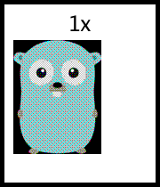
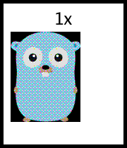
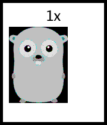
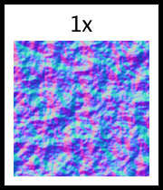
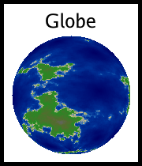

<!-- Code generated by cmd/bootstrap/main.go; DO NOT EDIT. -->
# Pattern Gallery

This gallery lists all the fundamental patterns available in `go-pattern`.
Each pattern corresponds to a CLI command and a Go constructor.


## Voronoi


**Go Function:** `NewVoronoi`

**CLI Command:** `voronoi  `

```go
// Define some points and colors
points := []image.Point{
	{50, 50}, {200, 50}, {125, 125}, {50, 200}, {200, 200},
}
colors := []color.Color{
	color.RGBA{255, 100, 100, 255},
	color.RGBA{100, 255, 100, 255},
	color.RGBA{100, 100, 255, 255},
	color.RGBA{255, 255, 100, 255},
	color.RGBA{100, 255, 255, 255},
}

i := NewVoronoi(points, colors)
f, err := os.Create(VoronoiOutputFilename)
if err != nil {
	panic(err)
}
defer func() {
	if e := f.Close(); e != nil {
		panic(e)
	}
}()
if err = png.Encode(f, i); err != nil {
	panic(err)
}
```

---

## KnollDither




**Go Function:** `NewKnollDither`

**CLI Command:** `knoll_dither <image> color.Palette int`

```go
img := NewGopher()
return NewKnollDither(img, Windows16, 8)
```

---

## Yliluoma2Dither




**Go Function:** `NewYliluoma2Dither`

**CLI Command:** `yliluoma2_dither <image> color.Palette int`

```go
img := NewGopher()
return NewYliluoma2Dither(img, Windows16, 8)
```

---

## Yliluoma1Dither




**Go Function:** `NewYliluoma1Dither`

**CLI Command:** `yliluoma1_dither <image> color.Palette int`

```go
img := NewGopher()
return NewYliluoma1Dither(img, Windows16, 8)
```

---

## Warp


**Go Function:** `NewWarp`

**CLI Command:** `warp <image>`

```go
// Standard demo: Grid warped by noise
// We want a visual that clearly shows the warping effect.
// A checkerboard is good.

checker := NewChecker(
	color.RGBA{200, 200, 200, 255},
	color.RGBA{50, 50, 50, 255},
)

// Distortion noise
noise := NewNoise(NoiseSeed(99), SetNoiseAlgorithm(&PerlinNoise{
	Frequency: 0.03,
	Octaves: 2,
}))

// Apply Warp
warped := NewWarp(checker,
	WarpDistortion(noise),
	WarpScale(10.0),
)

fmt.Println(warped.At(10, 10))
// Output: {50 50 50 255}
```

---

## Shojo


**Go Function:** `NewShojo`

**CLI Command:** `shojo `

```go
i := NewShojo()
f, err := os.Create(ShojoOutputFilename)
if err != nil {
	panic(err)
}
defer func() {
	if e := f.Close(); e != nil {
		panic(e)
	}
}()
if err = png.Encode(f, i); err != nil {
	panic(err)
}
```

---

## GrassClose


**Go Function:** `NewGrassClose`

**CLI Command:** `grass_close `

```go
// 1. Background: Dirt
dirt := NewColorMap(
	NewNoise(SetFrequency(0.05), NoiseSeed(1)),
	ColorStop{0.0, color.RGBA{40, 30, 20, 255}},
	ColorStop{1.0, color.RGBA{80, 60, 40, 255}},
)

// 2. Wind map (Perlin noise)
wind := NewNoise(
	SetFrequency(0.01),
	NoiseSeed(2),
	SetNoiseAlgorithm(&PerlinNoise{Seed: 2, Octaves: 2, Persistence: 0.5}),
)

// 3. Density map (Worley noise for clumping)
density := NewWorleyNoise(
	SetFrequency(0.02),
	SetSeed(3),
)

// 4. Grass Layer
grass := NewGrassClose(
	SetBladeHeight(35),
	SetBladeWidth(5),
	SetFillColor(color.RGBA{20, 160, 30, 255}),
	SetWindSource(wind),
	SetDensitySource(density),
	// Background source
	func(p any) {
		if g, ok := p.(*GrassClose); ok {
			g.Source = dirt
		}
	},
)

f, err := os.Create(GrassCloseOutputFilename)
if err != nil {
	panic(err)
}
defer func() {
	if e := f.Close(); e != nil {
		panic(e)
	}
}()
if err = png.Encode(f, grass); err != nil {
	panic(err)
}
```

---

## Tile


**Go Function:** `NewTile`

**CLI Command:** `tile <image> image.Rectangle`

```go
gopher := NewScale(NewGopher(), ScaleToRatio(0.25))
// Tile the gopher in a 200x200 area
return NewTile(gopher, image.Rect(0, 0, 200, 200))
```

---

## Polka


**Go Function:** `NewPolka`

**CLI Command:** `polka `

```go
i := NewPolka(
	SetRadius(10),
	SetSpacing(40),
	SetFillColor(color.Black),
	SetSpaceColor(color.White),
)
f, err := os.Create(PolkaOutputFilename)
if err != nil {
	panic(err)
}
defer func() {
	if e := f.Close(); e != nil {
		panic(e)
	}
}()
if err = png.Encode(f, i); err != nil {
	panic(err)
}
```

---

## Brick


**Go Function:** `NewBrick`

**CLI Command:** `brick `

```go
return NewBrick(
	SetBrickSize(50, 20),
	SetMortarSize(4),
)
```

---

## NormalMap




**Go Function:** `NewNormalMap`

**CLI Command:** `normal_map <image>`

```go
// Create a height map using Perlin noise
noise := NewNoise(
	NoiseSeed(123),
	SetNoiseAlgorithm(&PerlinNoise{
		Seed:        123,
		Octaves:     4,
		Persistence: 0.5,
		Lacunarity:  2.0,
		Frequency:   0.05,
	}),
)

// Convert to normal map with strength 5.0
return NewNormalMap(noise, NormalMapStrength(5.0))
```

---

## CrossHatch


**Go Function:** `NewCrossHatch`

**CLI Command:** `cross_hatch `

```go
i := NewCrossHatch(
	SetAngles(45, -45),
	SetLineSize(2),
	SetSpaceSize(8),
	SetLineColor(color.RGBA{0, 0, 0, 255}),
	SetSpaceColor(color.RGBA{255, 255, 255, 255}),
)
f, err := os.Create(CrossHatchOutputFilename)
if err != nil {
	panic(err)
}
defer func() {
	if e := f.Close(); e != nil {
		panic(e)
	}
}()
if err = png.Encode(f, i); err != nil {
	panic(err)
}
```

---

## WorleyNoise


**Go Function:** `NewWorleyNoise`

**CLI Command:** `worley_noise `

```go
// Standard F1 Euclidean Worley Noise
i := NewWorleyNoise(
	SetFrequency(0.05),
	SetSeed(1),
)
f, err := os.Create(WorleyNoiseOutputFilename)
if err != nil {
	panic(err)
}
defer func() {
	if e := f.Close(); e != nil {
		panic(e)
	}
}()
if err = png.Encode(f, i); err != nil {
	panic(err)
}
```

---

## Null


**Go Function:** `NewNull`

**CLI Command:** `null `

```go
i := NewNull()
f, err := os.Create(NullOutputFilename)
if err != nil {
	panic(err)
}
defer func() {
	if e := f.Close(); e != nil {
		panic(e)
	}
}()
if err = png.Encode(f, i); err != nil {
	panic(err)
}
```

---

## Scales


**Go Function:** `NewScales`

**CLI Command:** `scales `

```go
// Use the explicit Scales pattern for proper overlapping geometry.
// Radius 40, SpacingX 40 (touching horizontally), SpacingY 20 (half-overlap vertically).
pattern := NewScales(
	SetScaleRadius(40),
	SetScaleXSpacing(40),
	SetScaleYSpacing(25),
)

// The Scales pattern returns a heightmap (0 edge, 1 center).
// We want to map this to look like a tough fish scale.
// Center: Shiny/Metallic
// Gradient towards edge.
// Edge: Dark border.

scales := NewColorMap(pattern,
	ColorStop{Position: 0.0, Color: color.RGBA{10, 10, 10, 255}},    // Deep edge (overlap shadow)
	ColorStop{Position: 0.2, Color: color.RGBA{40, 40, 30, 255}},    // Rim
	ColorStop{Position: 0.5, Color: color.RGBA{100, 100, 80, 255}},  // Body
	ColorStop{Position: 0.8, Color: color.RGBA{160, 150, 120, 255}}, // Highlight start
	ColorStop{Position: 1.0, Color: color.RGBA{200, 190, 160, 255}}, // Peak Highlight
)

f, err := os.Create(ScalesOutputFilename)
if err != nil {
	panic(err)
}
defer func() {
	if e := f.Close(); e != nil {
		panic(e)
	}
}()
if err = png.Encode(f, scales); err != nil {
	panic(err)
}
```

---

## ScreenTone


**Go Function:** `NewScreenTone`

**CLI Command:** `screen_tone `

```go
i := NewScreenTone(
	SetRadius(3),
	SetSpacing(10),
	SetAngle(45),
	SetFillColor(color.Black),
	SetSpaceColor(color.White),
)
f, err := os.Create(ScreenToneOutputFilename)
if err != nil {
	panic(err)
}
defer func() {
	if e := f.Close(); e != nil {
		panic(e)
	}
}()
if err = png.Encode(f, i); err != nil {
	panic(err)
}
```

---

## Globe




**Go Function:** `NewGlobe`

**CLI Command:** `globe `

```go
ExampleNewGlobe_Projected()
```

---

## Checker


**Go Function:** `NewChecker`

**CLI Command:** `checker color.Color color.Color`

```go
i := NewChecker(color.Black, color.White)
f, err := os.Create(CheckerOutputFilename)
if err != nil {
	panic(err)
}
defer func() {
	if e := f.Close(); e != nil {
		panic(e)
	}
}()
if err = png.Encode(f, i); err != nil {
	panic(err)
}
```

---

## Grid


**Go Function:** `NewGrid`

**CLI Command:** `grid ...any`

```go
// Example 1: Simple 2x2 grid with Gophers
// Shrink the Gopher so it fits better
gopher := NewScale(NewGopher(), ScaleToRatio(0.25))

args := []any{
	Row(Cell(gopher), Cell(gopher)),
	Row(Cell(gopher), Cell(gopher)),
}
for _, op := range ops {
	args = append(args, op)
}

// Create a grid with explicit Rows
return NewGrid(args...)
```

---

## Padding


**Go Function:** `NewPadding`

**CLI Command:** `padding <image> ...PaddingOption`

```go
gopher := NewScale(NewGopher(), ScaleToRatio(0.5))
// Padding with transparent background (nil)
return NewPadding(gopher, PaddingMargin(20))
```

---

## HorizontalLine


**Go Function:** `NewHorizontalLine`

**CLI Command:** `horizontal_line `

```go
i := NewHorizontalLine(
	SetLineSize(5),
	SetSpaceSize(5),
	SetLineColor(color.RGBA{255, 0, 0, 255}),
	SetSpaceColor(color.White),
)
f, err := os.Create(HorizontalLineOutputFilename)
if err != nil {
	panic(err)
}
defer func() {
	if e := f.Close(); e != nil {
		panic(e)
	}
}()
if err = png.Encode(f, i); err != nil {
	panic(err)
}
```

---

## VerticalLine


**Go Function:** `NewVerticalLine`

**CLI Command:** `vertical_line `

```go
i := NewVerticalLine(
	SetLineSize(5),
	SetSpaceSize(5),
	SetLineColor(color.RGBA{0, 0, 255, 255}),
	SetSpaceColor(color.White),
)
f, err := os.Create(VerticalLineOutputFilename)
if err != nil {
	panic(err)
}
defer func() {
	if e := f.Close(); e != nil {
		panic(e)
	}
}()
if err = png.Encode(f, i); err != nil {
	panic(err)
}
```

---

## Noise


**Go Function:** `NewNoise`

**CLI Command:** `noise `

```go
// Create a noise pattern with a seeded algorithm (Hash) for stability
i := NewNoise(NoiseSeed(1))
f, err := os.Create(NoiseOutputFilename)
if err != nil {
	panic(err)
}
defer func() {
	if e := f.Close(); e != nil {
		panic(e)
	}
}()
if err = png.Encode(f, i); err != nil {
	panic(err)
}
```

---

## Rect


**Go Function:** `NewRect`

**CLI Command:** `rect `

```go
// A simple black rectangle (default)
i := NewRect()
// Output:

// Create the file for the example
f, err := os.Create(RectOutputFilename)
if err != nil {
	panic(err)
}
defer func() {
	if e := f.Close(); e != nil {
		panic(e)
	}
}()
if err = png.Encode(f, i); err != nil {
	panic(err)
}
```

---

## Gopher


**Go Function:** `NewGopher`

**CLI Command:** `gopher `

```go
i := NewGopher()
f, err := os.Create(GopherOutputFilename)
if err != nil {
	panic(err)
}
defer func() {
	if e := f.Close(); e != nil {
		panic(e)
	}
}()
if err = png.Encode(f, i); err != nil {
	panic(err)
}
```

---

## Circle


**Go Function:** `NewCircle`

**CLI Command:** `circle `

```go
// Create a simple circle
c := NewCircle(SetLineColor(color.Black), SetSpaceColor(color.White))
fmt.Printf("Circle bounds: %v\n", c.Bounds())
// Output:
// Circle bounds: (0,0)-(255,255)

f, err := os.Create(CircleOutputFilename)
if err != nil {
	panic(err)
}
defer func() {
	if e := f.Close(); e != nil {
		panic(e)
	}
}()
if err = png.Encode(f, c); err != nil {
	panic(err)
}
```

---

## Heatmap


**Go Function:** `NewHeatmap`

**CLI Command:** `heatmap HeatmapFunc`

```go
// See GenerateHeatmap for implementation details
```

---

## Fibonacci


**Go Function:** `NewFibonacci`

**CLI Command:** `fibonacci `

```go
// Create a simple Fibonacci spiral
c := NewFibonacci(SetLineColor(color.Black), SetSpaceColor(color.White))
fmt.Printf("Fibonacci bounds: %v\n", c.Bounds())
// Output:
// Fibonacci bounds: (0,0)-(255,255)

f, err := os.Create(FibonacciOutputFilename)
if err != nil {
	panic(err)
}
defer func() {
	if e := f.Close(); e != nil {
		panic(e)
	}
}()
if err = png.Encode(f, c); err != nil {
	panic(err)
}
```

---

## ColorMap


**Go Function:** `NewColorMap`

**CLI Command:** `color_map <image> ...ColorStop`

```go
// 1. Create a Noise source (Perlin Noise with FBM)
noise := NewNoise(
	NoiseSeed(42), // Fixed seed for reproducible documentation
	SetNoiseAlgorithm(&PerlinNoise{
		Seed:        42,
		Octaves:     4,
		Persistence: 0.5,
		Lacunarity:  2.0,
		Frequency:   0.1,
	}),
)

// 2. Map the noise to a "Grass" color ramp
grass := NewColorMap(noise,
	ColorStop{Position: 0.0, Color: color.RGBA{0, 50, 0, 255}},     // Deep shadow green
	ColorStop{Position: 0.4, Color: color.RGBA{10, 100, 10, 255}},  // Mid green
	ColorStop{Position: 0.7, Color: color.RGBA{50, 150, 30, 255}},  // Light green
	ColorStop{Position: 1.0, Color: color.RGBA{100, 140, 60, 255}}, // Dried tip
)

f, err := os.Create(ColorMapOutputFilename)
if err != nil {
	panic(err)
}
defer func() {
	if e := f.Close(); e != nil {
		panic(e)
	}
}()
if err = png.Encode(f, grass); err != nil {
	panic(err)
}
```

---

## SpeedLines


**Go Function:** `NewSpeedLines`

**CLI Command:** `speed_lines `

```go
i := NewSpeedLines(
	SetDensity(150),
	SetMinRadius(30),
	SetMaxRadius(80),
)
f, err := os.Create(SpeedLinesOutputFilename)
if err != nil {
	panic(err)
}
defer func() {
	if e := f.Close(); e != nil {
		panic(e)
	}
}()
if err = png.Encode(f, i); err != nil {
	panic(err)
}
```

---

## LinearGradient


**Go Function:** `NewLinearGradient`

**CLI Command:** `linear_gradient `

```go
// Linear Gradient (Horizontal)
NewLinearGradient(
	SetStartColor(color.RGBA{255, 0, 0, 255}),
	SetEndColor(color.RGBA{0, 0, 255, 255}),
)
```

---

## SimpleZoom


**Go Function:** `NewSimpleZoom`

**CLI Command:** `simple_zoom <image> int`

```go
i := NewSimpleZoom(NewChecker(color.Black, color.White), 2)
f, err := os.Create(SimpleZoomOutputFilename)
if err != nil {
	panic(err)
}
defer func() {
	if e := f.Close(); e != nil {
		panic(e)
	}
}()
if err = png.Encode(f, i); err != nil {
	panic(err)
}
```

---

## Quantize


**Go Function:** `NewQuantize`

**CLI Command:** `quantize <image> int`

```go
i := NewQuantize(NewGopher(), 4)
f, err := os.Create(QuantizeOutputFilename)
if err != nil {
	panic(err)
}
defer func() {
	if e := f.Close(); e != nil {
		panic(e)
	}
}()
if err = png.Encode(f, i); err != nil {
	panic(err)
}
```

---

## RadialGradient


**Go Function:** `NewRadialGradient`

**CLI Command:** `radial_gradient `

```go
// Radial Gradient
NewRadialGradient(
	SetStartColor(color.RGBA{255, 0, 0, 255}),
	SetEndColor(color.RGBA{0, 0, 255, 255}),
)
```

---

## Transposed


**Go Function:** `NewTransposed`

**CLI Command:** `transposed <image> int int`

```go
i := NewTransposed(NewDemoNull(), 10, 10)
f, err := os.Create(TransposedOutputFilename)
if err != nil {
	panic(err)
}
defer func() {
	if e := f.Close(); e != nil {
		panic(e)
	}
}()
if err = png.Encode(f, i); err != nil {
	panic(err)
}
```

---

## Bayer2x2Dither


**Go Function:** `NewBayer2x2Dither`

**CLI Command:** `bayer2x2_dither <image> color.Palette`

```go
// Black and White Palette
palette := []color.Color{color.Black, color.White}
i := NewBayer2x2Dither(NewGopher(), palette)

f, err := os.Create(Bayer2x2DitherOutputFilename)
if err != nil {
	panic(err)
}
defer func() {
	if e := f.Close(); e != nil {
		panic(e)
	}
}()
if err = png.Encode(f, i); err != nil {
	panic(err)
}
```

---

## ModuloStripe


**Go Function:** `NewModuloStripe`

**CLI Command:** `modulo_stripe `

```go
p := NewModuloStripe([]color.Color{
	color.RGBA{255, 0, 0, 255},
	color.RGBA{0, 255, 0, 255},
	color.RGBA{0, 0, 255, 255},
})
f, err := os.Create(ModuloStripeOutputFilename)
if err != nil {
	panic(err)
}
defer f.Close()
if err := png.Encode(f, p); err != nil {
	panic(err)
}
```

---

## ConcentricRings


**Go Function:** `NewConcentricRings`

**CLI Command:** `concentric_rings `

```go
p := NewConcentricRings([]color.Color{
	color.Black,
	color.White,
	color.RGBA{255, 0, 0, 255},
})
f, err := os.Create(ConcentricRingsOutputFilename)
if err != nil {
	panic(err)
}
defer f.Close()
if err := png.Encode(f, p); err != nil {
	panic(err)
}
```

---

## ConicGradient


**Go Function:** `NewConicGradient`

**CLI Command:** `conic_gradient `

```go
// Conic Gradient
NewConicGradient(
	SetStartColor(color.RGBA{255, 0, 255, 255}),
	SetEndColor(color.RGBA{0, 255, 255, 255}),
)
```

---

## Mirror


**Go Function:** `NewMirror`

**CLI Command:** `mirror <image> bool bool`

```go
i := NewMirror(NewDemoMirrorInput(image.Rect(0, 0, 40, 40)), true, false)
f, err := os.Create(MirrorOutputFilename)
if err != nil {
	panic(err)
}
defer func() {
	if e := f.Close(); e != nil {
		panic(e)
	}
}()
if err = png.Encode(f, i); err != nil {
	panic(err)
}
```

---

## Plasma


**Go Function:** `NewPlasma`

**CLI Command:** `plasma `

```go
p := NewPlasma()
f, err := os.Create(PlasmaOutputFilename)
if err != nil {
	panic(err)
}
defer f.Close()
if err := png.Encode(f, p); err != nil {
	panic(err)
}
```

---

## Rotate


**Go Function:** `NewRotate`

**CLI Command:** `rotate <image> int`

```go
i := NewRotate(NewDemoRotateInput(image.Rect(0, 0, 40, 60)), 90)
f, err := os.Create(RotateOutputFilename)
if err != nil {
	panic(err)
}
defer func() {
	if e := f.Close(); e != nil {
		panic(e)
	}
}()
if err = png.Encode(f, i); err != nil {
	panic(err)
}
```

---

## BayerDither


**Go Function:** `NewBayerDither`

**CLI Command:** `bayer_dither <image> int`

```go
grad := NewLinearGradient(
	SetStartColor(color.Black),
	SetEndColor(color.White),
)
p := NewBayerDither(grad, 4)
f, err := os.Create(BayerDitherOutputFilename)
if err != nil {
	panic(err)
}
defer f.Close()
if err := png.Encode(f, p); err != nil {
	panic(err)
}
```

---

## BlueNoise


**Go Function:** `NewBlueNoise`

**CLI Command:** `blue_noise `

```go
p := NewBlueNoise()
f, err := os.Create(BlueNoiseOutputFilename)
if err != nil {
	panic(err)
}
defer f.Close()
if err := png.Encode(f, p); err != nil {
	panic(err)
}
```

---

## BitwiseAnd


**Go Function:** `NewBitwiseAnd`

**CLI Command:** `bitwise_and `

```go
h := NewHorizontalLine(SetLineSize(50), SetSpaceSize(50), SetLineColor(color.RGBA{255, 0, 0, 255}))
v := NewVerticalLine(SetLineSize(50), SetSpaceSize(50), SetLineColor(color.RGBA{0, 255, 0, 255}))
p := NewBitwiseAnd([]image.Image{h, v})
f, err := os.Create(BitwiseAndOutputFilename)
if err != nil {
	panic(err)
}
defer f.Close()
if err := png.Encode(f, p); err != nil {
	panic(err)
}
```

---

## SierpinskiTriangle


**Go Function:** `NewSierpinskiTriangle`

**CLI Command:** `sierpinski_triangle `

```go
b := image.Rect(0, 0, 150, 150)
i := NewSierpinskiTriangle(SetBounds(b), SetFillColor(color.Black), SetSpaceColor(color.White))
f, err := os.Create(SierpinskiTriangleOutputFilename)
if err != nil {
	panic(err)
}
defer f.Close()
if err = png.Encode(f, i); err != nil {
	panic(err)
}
```

---

## VHS


**Go Function:** `NewVHS`

**CLI Command:** `v_h_s <image>`

```go
// Use the embedded Gopher image as the source
src := NewGopher()

// Apply VHS effect
i := NewVHS(src,
	SetScanlineFrequency(math.Pi),
	SetScanlineIntensity(0.3),
	SetColorOffset(4),
	SetNoiseIntensity(0.15),
	SetSeed(42),
)

f, err := os.Create(VHSOutputFilename)
if err != nil {
	panic(err)
}
defer f.Close()
if err = png.Encode(f, i); err != nil {
	panic(err)
}
```

---

## SierpinskiCarpet


**Go Function:** `NewSierpinskiCarpet`

**CLI Command:** `sierpinski_carpet `

```go
b := image.Rect(0, 0, 150, 150)
i := NewSierpinskiCarpet(SetBounds(b), SetFillColor(color.Black), SetSpaceColor(color.White))
f, err := os.Create(SierpinskiCarpetOutputFilename)
if err != nil {
	panic(err)
}
defer f.Close()
if err = png.Encode(f, i); err != nil {
	panic(err)
}
```

---

## EdgeDetect


**Go Function:** `NewEdgeDetect`

**CLI Command:** `edge_detect <image>`

```go
i := NewDemoEdgeDetect()
f, err := os.Create(EdgeDetectOutputFilename)
if err != nil {
	panic(err)
}
defer func() {
	if e := f.Close(); e != nil {
		panic(e)
	}
}()
if err = png.Encode(f, i); err != nil {
	panic(err)
}
```

---

## ErrorDiffusion


**Go Function:** `NewErrorDiffusion`

**CLI Command:** `error_diffusion <image> DiffusionKernel color.Palette`

```go
// Standard example
i := NewDemoErrorDiffusion()
f, err := os.Create(ErrorDiffusionOutputFilename)
if err != nil {
	panic(err)
}
defer func() {
	if e := f.Close(); e != nil {
		panic(e)
	}
}()
if err = png.Encode(f, i); err != nil {
	panic(err)
}
```

---

## OrderedDither


**Go Function:** `NewOrderedDither`

**CLI Command:** `ordered_dither <image>  int color.Palette float64`

```go
i := NewDemoOrderedDither()
f, err := os.Create(OrderedDitherOutputFilename)
if err != nil {
	panic(err)
}
defer func() {
	if e := f.Close(); e != nil {
		panic(e)
	}
}()
if err = png.Encode(f, i); err != nil {
	panic(err)
}
```

---
