<!-- Code generated by cmd/bootstrap/main.go; DO NOT EDIT. -->
# Pattern Recipes

This cookbook contains recipes for creating specific textures and effects using `go-pattern`.


## Warp_terrain


```go
fbm := func(seed int64) image.Image {
	return NewNoise(NoiseSeed(seed), SetNoiseAlgorithm(&PerlinNoise{
		Frequency: 0.015,
		Octaves: 6,
		Persistence: 0.5,
		Lacunarity: 2.0,
	}))
}

base := fbm(101)

warp := NewNoise(NoiseSeed(202), SetNoiseAlgorithm(&PerlinNoise{
	Frequency: 0.01,
	Octaves: 2,
}))

warped := NewWarp(base,
	WarpDistortion(warp),
	WarpScale(80.0),
)

stops := []ColorStop{
	{0.0, color.RGBA{0, 0, 150, 255}},
	{0.2, color.RGBA{0, 50, 200, 255}},
	{0.22, color.RGBA{240, 230, 140, 255}},
	{0.3, color.RGBA{34, 139, 34, 255}},
	{0.6, color.RGBA{107, 142, 35, 255}},
	{0.8, color.RGBA{139, 69, 19, 255}},
	{0.9, color.RGBA{100, 100, 100, 255}},
	{0.98, color.RGBA{255, 250, 250, 255}},
}

return NewColorMap(warped, stops...)
```

---

## Warp_marble


```go
colors := []color.Color{
	color.RGBA{240, 240, 245, 255},
	color.RGBA{240, 240, 245, 255},
	color.RGBA{240, 240, 245, 255},
	color.RGBA{200, 200, 210, 255},
	color.RGBA{100, 100, 110, 255},
	color.RGBA{200, 200, 210, 255},
}
stripes := NewModuloStripe(colors)

noise := NewNoise(NoiseSeed(456), SetNoiseAlgorithm(&PerlinNoise{
	Frequency: 0.04,
	Octaves: 4,
	Persistence: 0.6,
}))

return NewWarp(stripes,
	WarpDistortion(noise),
	WarpScale(30.0),
)
```

---

## Sand_dunes


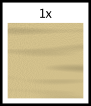

```go
// Base sand
sand := ExampleNewSand()

// 2. Ripples
ripples := NewNoise(
	NoiseSeed(404),
	SetNoiseAlgorithm(&PerlinNoise{
		Seed:      404,
		Frequency: 0.05,
	}),
)
// Stretch to make lines
ripplesStretched := NewScale(ripples, ScaleX(1.0), ScaleY(10.0))

// Darken troughs using Multiply
shadows := NewColorMap(ripplesStretched,
	ColorStop{Position: 0.0, Color: color.RGBA{180, 180, 180, 255}}, // Darker (Grey for Multiply)
	ColorStop{Position: 0.5, Color: color.White}, // No change
	ColorStop{Position: 1.0, Color: color.White}, // No change
)

// Rotate ripples
rotatedShadows := NewRotate(shadows, 90)

return NewBlend(sand, rotatedShadows, BlendMultiply)
```

---

## Snow


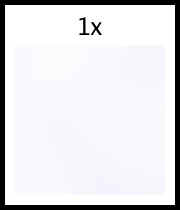

```go
// 1. Soft base noise (drifts) - Bright white/grey
drifts := NewNoise(
	NoiseSeed(505),
	SetNoiseAlgorithm(&PerlinNoise{
		Seed:      505,
		Frequency: 0.01,
	}),
)

snowColor := NewColorMap(drifts,
	ColorStop{Position: 0.0, Color: color.RGBA{240, 240, 250, 255}}, // Slight blue-grey shadow
	ColorStop{Position: 1.0, Color: color.White},
)

// 2. Sparkle: Use white/blue dots.
// We can use Scatter pattern to place small bright dots.
// But let's fix the noise approach.
// High frequency noise, thresholded.
sparkleNoise := NewNoise(
	NoiseSeed(606),
	SetNoiseAlgorithm(&PerlinNoise{Frequency: 0.8}),
)

// We want sparkles to be White/Blue on Transparent background.
// Then Overlay or Screen them.
// If background is Transparent, Screen (1-(1-A)*(1-B)) of Snow(A) and Transparent(B=0) -> A.
// So sparkles need to be Additive.
// Or we can just use Mix/Over.

sparkles := NewColorMap(sparkleNoise,
	ColorStop{Position: 0.0, Color: color.Transparent},
	ColorStop{Position: 0.9, Color: color.Transparent},
	ColorStop{Position: 0.92, Color: color.RGBA{200, 220, 255, 255}}, // Blue tint
	ColorStop{Position: 1.0, Color: color.White},
)

// Use BlendNormal (Over) for sparkles
return NewBlend(snowColor, sparkles, BlendNormal)
```

---

## Snow_tracks


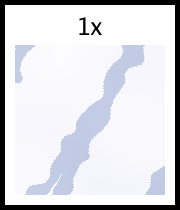

```go
snow := ExampleNewSnow()

// 3. Compression Tracks: Blueish/Grey depression.
tracks := NewCrossHatch(
	SetLineColor(color.RGBA{200, 210, 230, 255}), // Icy blue/grey
	SetSpaceColor(color.White), // Neutral for Multiply
	SetLineSize(15),
	SetSpaceSize(80),
	SetAngles(25, 35), // Overlapping tracks
)

// Distort tracks
distort := NewNoise(SetNoiseAlgorithm(&PerlinNoise{Frequency: 0.05}))
organicTracks := NewWarp(tracks, WarpDistortion(distort), WarpScale(8.0))

// Multiply tracks onto snow
// LineColor (Blueish) * Snow (White) -> Blueish.
// SpaceColor (White) * Snow (White) -> White.
return NewBlend(snow, organicTracks, BlendMultiply)
```

---

## Road_terrain


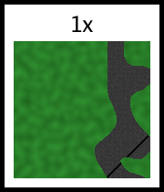

```go
// Winding road on grass

// 1. Terrain (Grass)
grass := NewNoise(SetNoiseAlgorithm(&PerlinNoise{Frequency: 0.1}))
grassColor := NewColorMap(grass,
	ColorStop{0.0, color.RGBA{30, 100, 30, 255}},
	ColorStop{1.0, color.RGBA{50, 150, 50, 255}},
)

// 2. Road Mask (Winding curve)
// We can use a low freq noise thresholded to a thin band?
// Or use `ModuloStripe` or `Sine` warped.
// Let's use a warped VerticalLine.

roadPath := NewVerticalLine(
	SetLineSize(40), // Road width
	SetSpaceSize(300),
	SetLineColor(color.White), // Mask: White = Road
	SetSpaceColor(color.Black), // Mask: Black = Grass
	SetPhase(105),
)

// Warp the road path to make it winding
warpNoise := NewNoise(NoiseSeed(999), SetNoiseAlgorithm(&PerlinNoise{Frequency: 0.02}))
windingRoadMask := NewWarp(roadPath, WarpDistortionX(warpNoise), WarpScale(50.0))

// 3. Road Texture
// Use asphalt from ExampleNewRoad, but we need to map it to the winding path?
// A simple tiled asphalt is fine.
roadTex := ExampleNewRoad()

// 4. Composite
// We have Grass (Bg), RoadTex (Fg), Mask (windingRoadMask).
// We don't have a MaskedBlend.
// Workaround:
// GrassPart = Grass * (NOT Mask)
// RoadPart = RoadTex * Mask
// Result = GrassPart + RoadPart

// Invert mask
invMask := NewBitwiseNot(windingRoadMask)

// Masking requires BitwiseAnd?
// But BitwiseAnd operates on colors bits.
// If Mask is pure Black/White, it works like a stencil for RGB.

grassPart := NewBitwiseAnd([]image.Image{grassColor, invMask})
roadPart := NewBitwiseAnd([]image.Image{roadTex, windingRoadMask})

return NewBitwiseOr([]image.Image{grassPart, roadPart})
```

---

## Road_marked


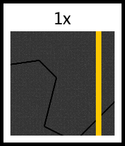

```go
road := ExampleNewRoad()

// Painted lines
// Yellow center line (dashed?)
// Let's do a solid double yellow or single yellow.
// VerticalLine pattern repeats.
// Image width is usually 255.
// We want one line in the center.
// LineSize 10. SpaceSize big enough to push next line off screen.

lines := NewVerticalLine(
	SetLineSize(8),
	SetSpaceSize(300),
	SetLineColor(color.RGBA{255, 200, 0, 255}), // Paint
	SetSpaceColor(color.Transparent),
	SetPhase(123), // Center: ~127 minus half line width (4) = 123.
)

// Composite lines over road using Normal blend (Paint on top)
return NewBlend(road, lines, BlendNormal)
```

---

## Road


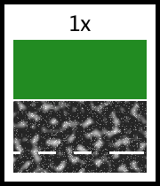

```go
// Asphalt: Aggregate noise (grey with black/white speckles)
base := NewNoise(
	NoiseSeed(707),
	SetNoiseAlgorithm(&PerlinNoise{Frequency: 0.8}),
)

asphalt := NewColorMap(base,
	ColorStop{Position: 0.0, Color: color.RGBA{40, 40, 40, 255}},
	ColorStop{Position: 0.2, Color: color.RGBA{60, 60, 60, 255}},
	ColorStop{Position: 0.5, Color: color.RGBA{50, 50, 50, 255}},
	ColorStop{Position: 0.8, Color: color.RGBA{70, 70, 70, 255}},
	ColorStop{Position: 1.0, Color: color.RGBA{90, 90, 90, 255}},
)

// Cracks: Voronoi edges
v2 := NewVoronoi(
	[]image.Point{
		{10, 10}, {50, 200}, {200, 50}, {220, 220},
		{100, 100}, {150, 150}, {80, 20}, {20, 80},
	},
	[]color.Color{color.Black, color.White},
)

edges := NewEdgeDetect(v2)
// Edges are white on black.

// Invert to get Black cracks on White background
cracks := NewBitwiseNot(edges)

// Multiply cracks onto asphalt
return NewBlend(asphalt, cracks, BlendMultiply)
```

---

## Islands


```go
// Layer 1: Base Shape (Worley F1 Euclidean) - Large distinct landmasses
baseShape := NewWorleyNoise(
	SetFrequency(0.01),
	SetSeed(555),
	SetWorleyOutput(OutputF1),
	SetWorleyMetric(MetricEuclidean),
)

// Layer 2: Detail (Perlin Noise) - Adds coastline complexity and terrain roughness
detail := NewNoise(
	SetNoiseAlgorithm(&PerlinNoise{
		Seed:        123,
		Frequency:   0.05,
		Octaves:     4,
		Persistence: 0.5,
		Lacunarity:  2.0,
	}),
)

// Blend: Subtract detail from base shape? Or Overlay?
// Worley F1 is 0 at center (Peak), 1 at edge (Deep Water).
// We want Peaks to be high (1.0). So let's Invert Worley first?
// Or just use ColorMap on the result.
// If we Add detail to Worley, the values increase.
// Let's use BlendOverlay to mix the gradients.

mixed := NewBlend(baseShape, detail, BlendOverlay)

// ColorMap:
// Worley: 0 (Peak) -> 1 (Edge)
// Overlay tends to push contrast.
// Let's define:
// 0.0 - 0.2: Snow (Peak)
// 0.2 - 0.4: Mountain/Rock
// 0.4 - 0.5: Forest
// 0.5 - 0.6: Sand
// 0.6 - 1.0: Water

islands := NewColorMap(mixed,
	ColorStop{Position: 0.0, Color: color.RGBA{250, 250, 250, 255}}, // Snow
	ColorStop{Position: 0.15, Color: color.RGBA{120, 120, 120, 255}}, // Rock
	ColorStop{Position: 0.30, Color: color.RGBA{34, 139, 34, 255}},  // Forest
	ColorStop{Position: 0.50, Color: color.RGBA{210, 180, 140, 255}}, // Sand
	ColorStop{Position: 0.55, Color: color.RGBA{64, 164, 223, 255}}, // Water
	ColorStop{Position: 1.0, Color: color.RGBA{0, 0, 128, 255}},     // Deep Water
)

f, err := os.Create(IslandsOutputFilename)
if err != nil {
	panic(err)
}
defer func() {
	if e := f.Close(); e != nil {
		panic(e)
	}
}()
if err = png.Encode(f, islands); err != nil {
	panic(err)
}
```

---

## Slate


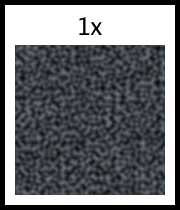

```go
// Slate: Layered noise, laminar structure.
// Dark grey, slight blue/green tint.

base := NewNoise(
	NoiseSeed(808),
	SetNoiseAlgorithm(&PerlinNoise{
		Seed:      808,
		Frequency: 0.05,
		Octaves:   5,
	}),
)

// Map to slate colors
slateColor := NewColorMap(base,
	ColorStop{Position: 0.0, Color: color.RGBA{40, 45, 50, 255}},
	ColorStop{Position: 0.5, Color: color.RGBA{60, 65, 70, 255}},
	ColorStop{Position: 1.0, Color: color.RGBA{80, 85, 90, 255}},
)

// Laminar effect: Scale Y slightly to stretch horizontally? Or vertically?
// Slate cleaves. Usually fine layers.
laminar := NewScale(slateColor, ScaleX(2.0), ScaleY(1.0))

// Surface bumpiness
bump := NewNoise(SetNoiseAlgorithm(&PerlinNoise{Frequency: 0.2}))

return NewBlend(laminar, bump, BlendOverlay)
```

---

## WindowsDitherHalftone


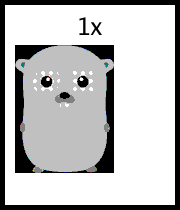

```go
img := NewGopher()
return NewHalftoneDither(img, 8, Windows16)
```

---

## CrackedMud


```go
// F2-F1 gives thick lines at cell boundaries (where distance to 1st and 2nd closest points are similar)
noise := NewWorleyNoise(
	SetFrequency(0.02),
	SetSeed(123),
	SetWorleyOutput(OutputF2MinusF1),
	SetWorleyMetric(MetricEuclidean),
)

// Map distance to mud colors.
// Low value (close to 0) means F1 ~= F2, i.e., boundary/crack.
// High value means center of cell.

mud := NewColorMap(noise,
	ColorStop{Position: 0.0, Color: color.RGBA{30, 20, 10, 255}},    // Crack (Dark brown/black)
	ColorStop{Position: 0.1, Color: color.RGBA{60, 40, 20, 255}},    // Crack edge
	ColorStop{Position: 0.2, Color: color.RGBA{130, 100, 70, 255}},  // Mud surface
	ColorStop{Position: 1.0, Color: color.RGBA{160, 120, 80, 255}},  // Center of mud chunk
)

f, err := os.Create(CrackedMudOutputFilename)
if err != nil {
	panic(err)
}
defer func() {
	if e := f.Close(); e != nil {
		panic(e)
	}
}()
if err = png.Encode(f, mud); err != nil {
	panic(err)
}
```

---

## WindowsDither4x4


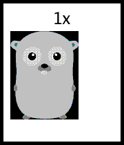

```go
img := NewGopher()
return NewBayer4x4Dither(img, Windows16)
```

---

## WindowsDither


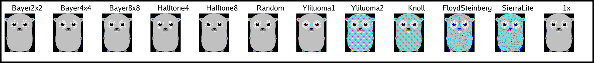

```go
img := NewGopher()
// Spread 0 = auto calculate, or we can fine tune.
// Standard Windows dithering often just used the nearest color after thresholding.
// We use NewBayer8x8Dither for "Standard Ordered Dithering".
return NewBayer8x8Dither(img, Windows16)
```

---

## Metal


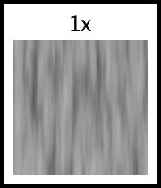

```go
// Brushed Metal
// 1. High frequency noise
noise := NewNoise(
	NoiseSeed(333),
	SetNoiseAlgorithm(&PerlinNoise{
		Seed:        333,
		Frequency:   0.1, // Lower frequency to avoid aliasing when scaled
		Octaves:     3,
		Persistence: 0.5,
	}),
)

// Map to grey gradients before scaling
metalBase := NewColorMap(noise,
	ColorStop{Position: 0.0, Color: color.RGBA{50, 50, 50, 255}},
	ColorStop{Position: 0.5, Color: color.RGBA{150, 150, 150, 255}},
	ColorStop{Position: 1.0, Color: color.RGBA{200, 200, 200, 255}},
)

// 2. Anisotropy: Scale heavily
// Scale X large, Y small? Or X 1, Y large?
// Vertical streaks: Scale Y > 1.
// But `NewScale` interpolates.
// Try Scale X=1, Y=10.
brushed := NewScale(metalBase, ScaleX(1.0), ScaleY(10.0))

return brushed
```

---

## Metal_scratched


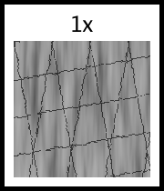

```go
// Base brushed metal
base := ExampleNewMetal()

// Scratches using CrossHatch
hatchMultiply := NewCrossHatch(
	SetLineColor(color.Gray{100}), // Dark scratches
	SetSpaceColor(color.White),    // No change
	SetLineSize(1),
	SetSpaceSize(40),
	SetAngles(10, 80, 170),
)

// Distort scratches slightly
distort := NewNoise(SetNoiseAlgorithm(&PerlinNoise{Frequency: 0.1}))
hatchWarped := NewWarp(hatchMultiply, WarpDistortion(distort), WarpScale(2.0))

return NewBlend(base, hatchWarped, BlendMultiply)
```

---

## Grass


```go
// 1. Create a base noise layer for general color variation.
baseNoise := NewNoise(
	SetNoiseAlgorithm(&PerlinNoise{
		Seed:        500,
		Frequency:   0.02,
		Octaves:     4,
		Persistence: 0.5,
		Lacunarity:  2.0,
	}),
)

// 2. Create a high-frequency noise layer for "blades" or detail.
detailNoise := NewNoise(
	SetNoiseAlgorithm(&PerlinNoise{
		Seed:        600,
		Frequency:   0.2, // High frequency for grass blades
		Octaves:     2,
		Persistence: 0.5,
		Lacunarity:  2.0,
	}),
)

// 3. Blend them. We want the detail to be prominent but influenced by the base.
// Multiply might darken too much, let's use Overlay or just simple addition/average.
// Actually, let's just use the detail noise warped by base noise for a wind-blown look?
// Or simply blend them.

// Let's try blending: Base * 0.5 + Detail * 0.5
// Using BlendAverage is simple.
blended := NewBlend(baseNoise, detailNoise, BlendAverage)

// 4. Map to Grass Colors.
grass := NewColorMap(blended,
	ColorStop{Position: 0.0, Color: color.RGBA{10, 40, 10, 255}},    // Deep shadow/dirt
	ColorStop{Position: 0.3, Color: color.RGBA{30, 80, 30, 255}},    // Dark Grass
	ColorStop{Position: 0.6, Color: color.RGBA{60, 140, 40, 255}},   // Mid Grass
	ColorStop{Position: 0.8, Color: color.RGBA{100, 180, 60, 255}},  // Light Grass
	ColorStop{Position: 1.0, Color: color.RGBA{140, 220, 100, 255}}, // Tips/Highlights
)

f, err := os.Create(GrassOutputFilename)
if err != nil {
	panic(err)
}
defer func() {
	if e := f.Close(); e != nil {
		panic(e)
	}
}()
if err = png.Encode(f, grass); err != nil {
	panic(err)
}
```

---

## Candy


```go
// 1. Define colors for our candy.
colors := []color.RGBA{
	{255, 0, 0, 255},     // Red
	{0, 255, 0, 255},     // Green
	{0, 0, 255, 255},     // Blue
	{255, 255, 0, 255},   // Yellow
	{255, 165, 0, 255},   // Orange
	{139, 69, 19, 255},   // Brown
}

// 2. Create the Scatter pattern.
candy := NewScatter(
	SetScatterFrequency(0.04), // Controls size/spacing relative to pixels
	SetScatterDensity(0.9),    // High density
	SetScatterGenerator(func(u, v float64, hash uint64) (color.Color, float64) {
		// Radius of the candy
		radius := 14.0

		// Distance from center
		distSq := u*u + v*v
		if distSq > radius*radius {
			return color.Transparent, 0
		}
		dist := math.Sqrt(distSq)

		// Pick a random color based on hash
		colIdx := hash % uint64(len(colors))
		baseCol := colors[colIdx]

		// Simple shading: slightly darker at edges, highlight at top-left
		// Spherical shading approx
		// Normal vector (nx, ny, nz)
		// z = sqrt(1 - x^2 - y^2)
		nx := u / radius
		ny := v / radius
		nz := math.Sqrt(math.Max(0, 1.0 - nx*nx - ny*ny))

		// Light source direction (top-left)
		lx, ly, lz := -0.5, -0.5, 0.7
		lLen := math.Sqrt(lx*lx + ly*ly + lz*lz)
		lx, ly, lz = lx/lLen, ly/lLen, lz/lLen

		// Diffuse
		dot := nx*lx + ny*ly + nz*lz
		diffuse := math.Max(0, dot)

		// Specular (Glossy plastic look)
		// Reflected light vector
		// R = 2(N.L)N - L
		rx := 2*dot*nx - lx
		ry := 2*dot*ny - ly
		rz := 2*dot*nz - lz
		// View vector (straight up)
		vx, vy, vz := 0.0, 0.0, 1.0
		specDot := rx*vx + ry*vy + rz*vz
		specular := math.Pow(math.Max(0, specDot), 20) // Shininess

		// Apply lighting
		r := float64(baseCol.R) * (0.2 + 0.8*diffuse) + 255*specular*0.6
		g := float64(baseCol.G) * (0.2 + 0.8*diffuse) + 255*specular*0.6
		b := float64(baseCol.B) * (0.2 + 0.8*diffuse) + 255*specular*0.6

		// Clamp
		r = math.Min(255, math.Max(0, r))
		g = math.Min(255, math.Max(0, g))
		b = math.Min(255, math.Max(0, b))

		// Anti-aliasing at edge
		alpha := 1.0
		if dist > radius - 1.0 {
			alpha = radius - dist
		}

		// Use hash for random Z-ordering
		z := float64(hash) / 18446744073709551615.0

		return color.RGBA{
			R: uint8(r),
			G: uint8(g),
			B: uint8(b),
			A: uint8(alpha * 255),
		}, z
	}),
)

f, err := os.Create(CandyOutputFilename)
if err != nil {
	panic(err)
}
defer func() {
	if e := f.Close(); e != nil {
		panic(e)
	}
}()
if err = png.Encode(f, candy); err != nil {
	panic(err)
}
```

---

## Shojo_pink


```go
i := NewShojo(
	SetSpaceColor(color.RGBA{20, 0, 10, 255}),    // Dark red/brown bg
	SetFillColor(color.RGBA{255, 200, 220, 255}), // Pink sparkles
)
f, err := os.Create(Shojo_pinkOutputFilename)
if err != nil {
	panic(err)
}
defer func() {
	if e := f.Close(); e != nil {
		panic(e)
	}
}()
if err = png.Encode(f, i); err != nil {
	panic(err)
}
```

---

## Pebbles


```go
// Re-implement Pebbles using Scatter for true overlapping geometry.
pebbles := NewScatter(
	SetScatterFrequency(0.04), // Size control
	SetScatterDensity(1.0),    // Packed tight
	SetScatterMaxOverlap(1),
	SetScatterGenerator(func(u, v float64, hash uint64) (color.Color, float64) {
		// Randomize size slightly
		rSize := float64(hash&0xFF)/255.0
		radius := 12.0 + rSize*6.0 // 12 to 18 pixels radius

		// Perturb the shape using simple noise (simulated by sin/cos of hash+angle)
		// to make it "chipped" or irregular.
		angle := math.Atan2(v, u)
		dist := math.Sqrt(u*u + v*v)

		// Simple radial noise
		noise := math.Sin(angle*5 + float64(hash%10)) * 0.1
		noise += math.Cos(angle*13 + float64(hash%7)) * 0.05

		effectiveRadius := radius * (1.0 + noise)

		if dist > effectiveRadius {
			return color.Transparent, 0
		}

		// Stone Color: Grey/Brown variations
		grey := 100 + int(hash%100)
		col := color.RGBA{uint8(grey), uint8(grey - 5), uint8(grey - 10), 255}

		// Shading (diffuse)
		// Normal estimation for a flattened spheroid
		nx := u / effectiveRadius
		ny := v / effectiveRadius
		nz := math.Sqrt(math.Max(0, 1.0 - nx*nx - ny*ny))

		// Light dir
		lx, ly, lz := -0.5, -0.5, 0.7
		lLen := math.Sqrt(lx*lx + ly*ly + lz*lz)
		lx, ly, lz = lx/lLen, ly/lLen, lz/lLen

		diffuse := math.Max(0, nx*lx + ny*ly + nz*lz)

		// Apply shading
		r := float64(col.R) * (0.1 + 0.9*diffuse)
		g := float64(col.G) * (0.1 + 0.9*diffuse)
		b := float64(col.B) * (0.1 + 0.9*diffuse)

		// Soft edge anti-aliasing
		alpha := 1.0
		edgeDist := effectiveRadius - dist
		if edgeDist < 1.0 {
			alpha = edgeDist
		}

		// Use hash for random Z-ordering
		z := float64(hash) / 18446744073709551615.0

		return color.RGBA{
			R: uint8(math.Min(255, r)),
			G: uint8(math.Min(255, g)),
			B: uint8(math.Min(255, b)),
			A: uint8(alpha * 255),
		}, z
	}),
)

f, err := os.Create(PebblesOutputFilename)
if err != nil {
	panic(err)
}
defer func() {
	if e := f.Close(); e != nil {
		panic(e)
	}
}()
if err = png.Encode(f, pebbles); err != nil {
	panic(err)
}
```

---

## Water_surface


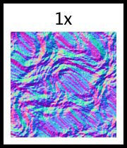

```go
// A variation showing just the normal map which is often what is used in game engines.
baseNoise := NewNoise(
	NoiseSeed(42),
	SetNoiseAlgorithm(&PerlinNoise{
		Seed:        42,
		Octaves:     5,
		Persistence: 0.6,
		Lacunarity:  2.0,
		Frequency:   0.04,
	}),
)

// Strong warp for "choppy" water
distortion := NewNoise(
	NoiseSeed(100),
	SetNoiseAlgorithm(&PerlinNoise{Seed: 100, Frequency: 0.02}),
)

warped := NewWarp(baseNoise, WarpDistortion(distortion), WarpScale(30.0))

return NewNormalMap(warped, NormalMapStrength(8.0))
```

---

## Stone


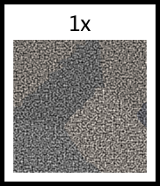

```go
// Voronoi base for cells (cobblestones)
// We want cells to be somewhat irregular.
voronoi := NewVoronoi(
	// Points
	[]image.Point{
		{50, 50}, {150, 40}, {230, 60},
		{40, 140}, {130, 130}, {240, 150},
		{60, 230}, {160, 240}, {220, 220},
		{100, 100}, {200, 200}, {30, 30},
		{180, 80}, {80, 180},
	},
	// Colors: Using Greyscale for heightmap initially, or color for texture
	// Let's make a texture.
	[]color.Color{
		color.RGBA{100, 100, 100, 255},
		color.RGBA{120, 115, 110, 255},
		color.RGBA{90, 90, 95, 255},
		color.RGBA{110, 110, 110, 255},
		color.RGBA{130, 125, 120, 255},
	},
)

// 1. Edge Wear: Distort the Voronoi
distort := NewNoise(
	NoiseSeed(77),
	SetNoiseAlgorithm(&PerlinNoise{Seed: 77, Frequency: 0.1}),
)
worn := NewWarp(voronoi, WarpDistortion(distort), WarpScale(5.0))

// 2. Surface Detail: Grain
grain := NewNoise(
	NoiseSeed(88),
	SetNoiseAlgorithm(&PerlinNoise{Seed: 88, Frequency: 0.5}),
)

// Blend grain onto stones (Overlay)
textured := NewBlend(worn, grain, BlendOverlay)

// We return the Albedo texture, not the normal map.
// Normal map can be a separate pass or derived.
return textured
```

---

## Stone_cobble


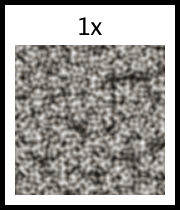

```go
// Cellular noise (Worley) for cobblestones heightmap
worley := NewWorleyNoise(
	SetWorleyMetric(MetricEuclidean),
	SetWorleyOutput(OutputF1), // Distance to closest point
	NoiseSeed(123),
	SetFrequency(0.06),
)

// Map Worley (0-1 distance) to Stone Colors
// Worley: 0 is center, 1 is edge.
// Cobbles: Center is high/bright, Edge is low/dark (mortar).
// We want to map the distance to a color gradient.

cobbleColor := NewColorMap(worley,
	ColorStop{Position: 0.0, Color: color.RGBA{180, 175, 170, 255}}, // Center (Light Stone)
	ColorStop{Position: 0.4, Color: color.RGBA{140, 135, 130, 255}}, // Mid Stone
	ColorStop{Position: 0.7, Color: color.RGBA{100, 95, 90, 255}},   // Dark Stone edge
	ColorStop{Position: 0.85, Color: color.RGBA{60, 55, 50, 255}},   // Mortar start
	ColorStop{Position: 1.0, Color: color.RGBA{40, 35, 30, 255}},    // Deep Mortar
)

// Add noise for texture
noise := NewNoise(SetNoiseAlgorithm(&PerlinNoise{Frequency: 0.2}))
textured := NewBlend(cobbleColor, noise, BlendOverlay)

return textured
```

---

## Dirt


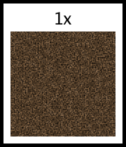

```go
// 1. Base Dirt: Brown, grainy noise
base := NewNoise(
	NoiseSeed(101),
	SetNoiseAlgorithm(&PerlinNoise{
		Seed:        101,
		Frequency:   0.1,
		Octaves:     4,
		Persistence: 0.6,
	}),
)

dirtColor := NewColorMap(base,
	ColorStop{Position: 0.0, Color: color.RGBA{40, 30, 20, 255}}, // Dark Brown
	ColorStop{Position: 0.5, Color: color.RGBA{80, 60, 40, 255}}, // Brown
	ColorStop{Position: 0.8, Color: color.RGBA{100, 80, 60, 255}}, // Light Brown
	ColorStop{Position: 1.0, Color: color.RGBA{120, 100, 80, 255}}, // Pebbles
)

// 2. Grain: High freq noise overlay
grain := NewNoise(SetNoiseAlgorithm(&PerlinNoise{Frequency: 0.5}))
detailed := NewBlend(dirtColor, grain, BlendOverlay)

return detailed
```

---

## Dirt_mud


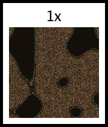

```go
// Base dirt
dirt := ExampleNewDirt()

// 3. Wetness Mask: Puddles
// Low frequency noise thresholded
puddleNoise := NewNoise(
	NoiseSeed(202),
	SetNoiseAlgorithm(&PerlinNoise{
		Seed:      202,
		Frequency: 0.02,
	}),
)

// Mask: White where puddles are, Black where dirt is
// Threshold at 0.6
mask := NewColorMap(puddleNoise,
	ColorStop{Position: 0.0, Color: color.Black},
	ColorStop{Position: 0.55, Color: color.Black},
	ColorStop{Position: 0.6, Color: color.White},
	ColorStop{Position: 1.0, Color: color.White},
)

// Puddles: Darker, smoother, reflective (mocked by color)
// Or use NormalMap to make them flat vs rough dirt.
// Let's make puddles dark brown/black and subtract detail.

puddleColor := NewRect(SetFillColor(color.RGBA{20, 15, 10, 255}))

// Blend puddle color based on mask?
// We don't have a "BlendMask" pattern yet that takes a mask image.
// But we can use boolean ops or just Blend?
// Or we can use the mask as alpha for the puddle layer and overlay it.
// But our patterns usually return opaque images unless alpha is handled.

// Let's assume we want to composite Puddle over Dirt using Mask.
// This usually requires a MaskedComposite pattern.
// I don't see one.

// Workaround:
// 1. Create Puddle Layer (Dark)
// 2. Create Dirt Layer
// 3. Blend them? No, we want distinct areas.
// If I use `NewBlend` with a mode? No standard mode does masking.

// I can use `NewBoolean` (BitwiseAnd) if mask is binary?
// Dirt AND (NOT Mask) + Puddle AND Mask.

// Invert mask for dirt
invMask := NewBitwiseNot(mask)

dirtPart := NewBitwiseAnd([]image.Image{dirt, invMask})
puddlePart := NewBitwiseAnd([]image.Image{puddleColor, mask})

return NewBitwiseOr([]image.Image{dirtPart, puddlePart})
```

---

## Molecules


```go
// Base Worley Noise (F1) provides the cellular structure
noise := NewWorleyNoise(
	SetFrequency(0.02),
	SetSeed(42),
	SetWorleyOutput(OutputF1),
	SetWorleyMetric(MetricEuclidean),
)

// ColorMap:
// Center (distance 0) -> Light
// Edge (distance ~0.5) -> Dark
// Gaps -> Black

molecules := NewColorMap(noise,
	ColorStop{Position: 0.0, Color: color.RGBA{180, 180, 190, 255}}, // Center
	ColorStop{Position: 0.4, Color: color.RGBA{100, 100, 110, 255}}, // Edge
	ColorStop{Position: 0.45, Color: color.RGBA{50, 50, 55, 255}},   // Darker edge
	ColorStop{Position: 0.5, Color: color.RGBA{10, 10, 10, 255}},    // Gap
	ColorStop{Position: 1.0, Color: color.RGBA{0, 0, 0, 255}},       // Deep gap
)

f, err := os.Create(MoleculesOutputFilename)
if err != nil {
	panic(err)
}
defer func() {
	if e := f.Close(); e != nil {
		panic(e)
	}
}()
if err = png.Encode(f, molecules); err != nil {
	panic(err)
}
```

---

## Warp_wood


```go
woodLight := color.RGBA{222, 184, 135, 255}
woodDark := color.RGBA{139, 69, 19, 255}

colors := []color.Color{}
steps := 20
for i := 0; i < steps; i++ {
	t := float64(i) / float64(steps-1)
	r := uint8(float64(woodLight.R)*(1-t) + float64(woodDark.R)*t)
	g := uint8(float64(woodLight.G)*(1-t) + float64(woodDark.G)*t)
	b := uint8(float64(woodLight.B)*(1-t) + float64(woodDark.B)*t)
	colors = append(colors, color.RGBA{r, g, b, 255})
}
for i := steps - 1; i >= 0; i-- {
	colors = append(colors, colors[i])
}

rings := NewConcentricRings(colors)

noiseLow := NewNoise(NoiseSeed(123), SetNoiseAlgorithm(&PerlinNoise{
	Frequency: 0.02,
	Octaves: 2,
}))

// Apply Warp
return NewWarp(rings,
	WarpDistortion(noiseLow),
	WarpScale(15.0),
)
```

---

## Clouds


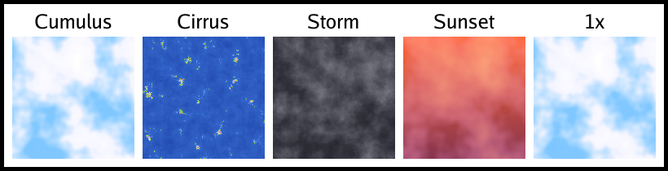

```go
return ExampleNewClouds_cumulus()
```

---

## Warp_clouds


```go
baseNoise := NewNoise(NoiseSeed(777), SetNoiseAlgorithm(&PerlinNoise{
	Frequency: 0.02,
	Octaves: 4,
	Persistence: 0.5,
}))

warpNoise := NewNoise(NoiseSeed(888), SetNoiseAlgorithm(&PerlinNoise{
	Frequency: 0.02,
	Octaves: 2,
}))

warped := NewWarp(baseNoise,
	WarpDistortion(warpNoise),
	WarpScale(50.0),
)

stops := []ColorStop{
	{0.0, color.RGBA{0, 100, 200, 255}},
	{0.4, color.RGBA{100, 150, 255, 255}},
	{0.6, color.RGBA{255, 255, 255, 255}},
	{1.0, color.RGBA{255, 255, 255, 255}},
}

return NewColorMap(warped, stops...)
```

---

## Sand_zoomed


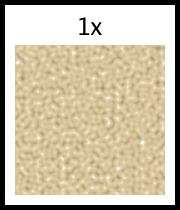

```go
// Zoomed in sand to show grains
// Use Scatter or just low freq noise mapped to dots?
// Let's use noise with thresholding to make "grains".

noise := NewNoise(
	NoiseSeed(304),
	SetNoiseAlgorithm(&PerlinNoise{Frequency: 0.2}),
)

// Map to distinct grains
grains := NewColorMap(noise,
	ColorStop{Position: 0.0, Color: color.RGBA{160, 140, 100, 255}}, // Dark grain
	ColorStop{Position: 0.4, Color: color.RGBA{210, 190, 150, 255}}, // Main sand
	ColorStop{Position: 0.7, Color: color.RGBA{230, 210, 170, 255}}, // Light grain
	ColorStop{Position: 0.9, Color: color.RGBA{255, 255, 255, 255}}, // Quartz sparkle
)

return grains
```

---

## Brick_stone


```go
// Create "Stone" textures
var stones []image.Image
for i := 0; i < 4; i++ {
	noise := NewNoise(SetNoiseAlgorithm(&PerlinNoise{
		Seed:      int64(i*50 + 123),
		Frequency: 0.2,
	}))
	// Grey/Blueish stone colors
	colored := NewColorMap(noise,
		ColorStop{0.0, color.RGBA{80, 80, 90, 255}},
		ColorStop{0.6, color.RGBA{120, 120, 130, 255}},
		ColorStop{1.0, color.RGBA{160, 160, 170, 255}},
	)
	stones = append(stones, colored)
}

mortar := NewUniform(color.RGBA{50, 50, 50, 255})

// Larger bricks/stones
return NewBrick(
	SetBrickSize(40, 30),
	SetMortarSize(6),
	SetBrickImages(stones...),
	SetMortarImage(mortar),
	SetBrickOffset(0.3), // Non-standard offset
)
```

---

## Clouds_cirrus


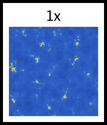

```go
// High frequency noise with high persistence to simulate wisps
wispyNoise := NewNoise(NoiseSeed(103), SetNoiseAlgorithm(&PerlinNoise{
	Frequency:   0.05,
	Octaves:     6,
	Persistence: 0.7,
}))

return NewColorMap(wispyNoise,
	ColorStop{0.0, color.RGBA{20, 50, 150, 255}},   // Dark Blue Sky
	ColorStop{0.6, color.RGBA{50, 100, 200, 255}},  // Blue
	ColorStop{0.7, color.RGBA{150, 200, 255, 100}}, // Faint wisp
	ColorStop{1.0, color.RGBA{255, 255, 255, 200}}, // Bright wisp
)
```

---

## Clouds_storm


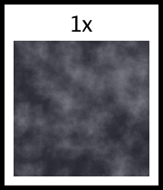

```go
// Layer 1: Large, brooding shapes
base := NewNoise(NoiseSeed(666), SetNoiseAlgorithm(&PerlinNoise{
	Frequency:   0.01,
	Octaves:     3,
}))

// Layer 2: Detailed turbulence
detail := NewNoise(NoiseSeed(777), SetNoiseAlgorithm(&PerlinNoise{
	Frequency:   0.04,
	Octaves:     5,
	Persistence: 0.6,
}))

// Blend them: Overlay adds contrast
blended := NewBlend(base, detail, BlendOverlay)

// Map to stormy colors
return NewColorMap(blended,
	ColorStop{0.0, color.RGBA{20, 20, 25, 255}},    // Darkest Grey
	ColorStop{0.4, color.RGBA{50, 50, 60, 255}},    // Dark Grey
	ColorStop{0.6, color.RGBA{80, 80, 90, 255}},    // Mid Grey
	ColorStop{0.8, color.RGBA{120, 120, 130, 255}}, // Light Grey highlights
	ColorStop{1.0, color.RGBA{160, 160, 170, 255}}, // Brightest peaks
)
```

---

## Clouds_sunset


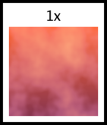

```go
// 1. Sky Gradient (Orange to Purple)
sky := NewLinearGradient(
	SetStartColor(color.RGBA{255, 100, 50, 255}),  // Orange/Red Horizon
	SetEndColor(color.RGBA{50, 20, 100, 255}),     // Purple/Blue Zenith
	GradientVertical(),
)

// 2. Cloud Shapes
clouds := NewNoise(NoiseSeed(888), SetNoiseAlgorithm(&PerlinNoise{
	Frequency:   0.012,
	Octaves:     4,
}))

// Map cloud noise to alpha/color
// We want the clouds to be dark at the bottom (shadow) and pink/gold at the edges
cloudColor := NewColorMap(clouds,
	ColorStop{0.0, color.Black},                        // No clouds
	ColorStop{0.4, color.Black},                        // No clouds
	ColorStop{0.5, color.RGBA{80, 40, 60, 255}},        // Dark cloud base
	ColorStop{0.7, color.RGBA{200, 100, 80, 255}},      // Orange/Pink mid
	ColorStop{1.0, color.RGBA{255, 200, 100, 255}},     // Gold highlights
)

// 3. Composite Clouds over Sky using Screen blend mode for a glowing effect
return NewBlend(sky, cloudColor, BlendScreen)
```

---

## Water


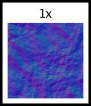

```go
// 1. Base Noise: Simplex/Perlin noise (FBM)
baseNoise := NewNoise(
	NoiseSeed(1),
	SetNoiseAlgorithm(&PerlinNoise{
		Seed:        1,
		Octaves:     6,
		Persistence: 0.5,
		Lacunarity:  2.0,
		Frequency:   0.03,
	}),
)

// 2. Flow Maps: We simulate flow by warping the noise.
// We'll use another lower frequency noise as the vector field (x/y displacement).
// Since Warp takes one image for X and Y, we can use the same noise or different ones.
// Let's create a "flow" map.
flowX := NewNoise(
	NoiseSeed(2),
	SetNoiseAlgorithm(&PerlinNoise{
		Seed:      2,
		Frequency: 0.01,
	}),
)

// Apply warp
warped := NewWarp(baseNoise,
	WarpDistortionX(flowX),
	WarpDistortionY(flowX), // Using same for simplicity, or could offset.
	WarpScale(20.0),
)

// 3. Normal Map: Convert the heightmap to normals
normals := NewNormalMap(warped, NormalMapStrength(4.0))

// 4. Colorization: We can use the normal map directly (it looks cool/techy),
// or we can try to render it. But the prompt asked for "normals + flow maps".
// Usually water is rendered with reflection/refraction which needs a shader.
// Here we can output the normal map as the representation of the water surface.
// Or we can blend it with a blue tint to make it look like water.

waterBlue := color.RGBA{0, 0, 100, 255}
waterTint := NewRect(SetFillColor(waterBlue))

// Blend normals with blue using Overlay or SoftLight
// Overlay might be too harsh for normals.
// Let's just return the normal map as it is the "texture" of water surface.
// Or maybe "Multiply" the blue with the normal map to tint it.

blended := NewBlend(normals, waterTint, BlendAverage)

return blended
```

---

## Starfield


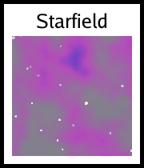

```go
img := GenerateStarfield(image.Rect(0, 0, 150, 150))
f, err := os.Create(StarfieldOutputFilename)
if err != nil {
	panic(err)
}
defer f.Close()
if err = png.Encode(f, img); err != nil {
	panic(err)
}
```

---

## Shojo_blue


```go
i := NewShojo(
	SetSpaceColor(color.RGBA{0, 0, 40, 255}),     // Dark blue bg
	SetFillColor(color.RGBA{200, 220, 255, 255}), // Blueish sparkles
)
f, err := os.Create(Shojo_blueOutputFilename)
if err != nil {
	panic(err)
}
defer func() {
	if e := f.Close(); e != nil {
		panic(e)
	}
}()
if err = png.Encode(f, i); err != nil {
	panic(err)
}
```

---

## Lava


```go
// This function is for the testable example and documentation.
// It creates the file directly.
img := GenerateLava(image.Rect(0, 0, 150, 150))
f, err := os.Create(LavaOutputFilename)
if err != nil {
	panic(err)
}
defer f.Close()
if err = png.Encode(f, img); err != nil {
	panic(err)
}
```

---

## Brick_textures


```go
// Bricks with variations
// Create 3 variations of brick textures using Noise
var bricks []image.Image
for i := 0; i < 3; i++ {
	// Noise with different seeds to ensure different texture per variant
	noise := NewNoise(SetNoiseAlgorithm(&PerlinNoise{
		Seed:      int64(i*100 + 1),
		Frequency: 0.1,
	}))

	// Tint the noise red/brown
	colored := NewColorMap(noise,
		ColorStop{0.0, color.RGBA{100, 30, 30, 255}},
		ColorStop{1.0, color.RGBA{180, 60, 50, 255}},
	)
	bricks = append(bricks, colored)
}

// Mortar texture: grey noise
mortar := NewColorMap(
	NewNoise(SetNoiseAlgorithm(&PerlinNoise{
		Seed:      999,
		Frequency: 0.5,
	})),
	ColorStop{0.0, color.RGBA{180, 180, 180, 255}},
	ColorStop{1.0, color.RGBA{220, 220, 220, 255}},
)

return NewBrick(
	SetBrickSize(60, 25),
	SetMortarSize(3),
	SetBrickImages(bricks...),
	SetMortarImage(mortar),
)
```

---

## Clouds_cumulus


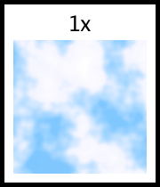

```go
// 1. Base shape: Low frequency noise to define the cloud blobs
noise := NewNoise(NoiseSeed(42), SetNoiseAlgorithm(&PerlinNoise{
	Frequency:   0.015,
	Octaves:     4,
	Persistence: 0.5,
	Lacunarity:  2.0,
}))

// 2. Color Map: Sky Blue -> White
// We use a steep ramp around 0.5-0.6 to create distinct cloud shapes
// rather than a smooth fog.
return NewColorMap(noise,
	ColorStop{0.0, color.RGBA{100, 180, 255, 255}}, // Blue Sky
	ColorStop{0.4, color.RGBA{130, 200, 255, 255}}, // Light Sky
	ColorStop{0.55, color.RGBA{245, 245, 255, 255}}, // Cloud Edge (White-ish)
	ColorStop{0.7, color.RGBA{255, 255, 255, 255}}, // Cloud Body
	ColorStop{1.0, color.RGBA{230, 230, 240, 255}}, // Cloud Shadow/Density
)
```

---

## NormalMap_sphere


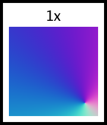

```go
// A simple sphere gradient to show curvature normals
grad := NewRadialGradient(
	GradientCenter(0.5, 0.5),
	SetStartColor(color.White),
	SetEndColor(color.Black),
)

// Increase strength significantly to visualize the curve on a smooth gradient
return NewNormalMap(grad, NormalMapStrength(30.0))
```

---

## Sand


```go
// 1. Fine grain noise
grain := NewNoise(
	NoiseSeed(303),
	SetNoiseAlgorithm(&PerlinNoise{
		Seed:        303,
		Frequency:   0.5,
		Octaves:     2,
	}),
)

sandColor := NewColorMap(grain,
	ColorStop{Position: 0.0, Color: color.RGBA{194, 178, 128, 255}}, // Sand
	ColorStop{Position: 1.0, Color: color.RGBA{225, 205, 150, 255}}, // Light Sand
)

return sandColor
```

---

## Cells


```go
// F1 Euclidean gives distance to center of cell.
// We want irregular organic cells.
noise := NewWorleyNoise(
	SetFrequency(0.02),
	SetSeed(777),
	SetWorleyOutput(OutputF1),
	SetWorleyMetric(MetricEuclidean),
	SetWorleyJitter(0.8), // High jitter for organic look
)

// ColorMap:
// 0.0 - 0.2: Nucleus (Dark Green)
// 0.2 - 0.25: Nucleus Membrane (Lighter)
// 0.25 - 0.7: Cytoplasm (Light Green, Translucent look)
// 0.7 - 0.9: Cell Wall Inner (Darker Green)
// 0.9 - 1.0: Cell Wall (Thick Dark Border)

cells := NewColorMap(noise,
	ColorStop{Position: 0.0, Color: color.RGBA{20, 80, 20, 255}},    // Nucleus Center
	ColorStop{Position: 0.18, Color: color.RGBA{40, 100, 40, 255}},  // Nucleus
	ColorStop{Position: 0.20, Color: color.RGBA{100, 180, 100, 255}},// Membrane
	ColorStop{Position: 0.25, Color: color.RGBA{150, 220, 150, 255}},// Cytoplasm Start
	ColorStop{Position: 0.70, Color: color.RGBA{140, 210, 140, 255}},// Cytoplasm End
	ColorStop{Position: 0.85, Color: color.RGBA{50, 120, 50, 255}},  // Wall Inner
	ColorStop{Position: 0.95, Color: color.RGBA{10, 40, 10, 255}},   // Wall Outer
	ColorStop{Position: 1.0, Color: color.RGBA{0, 20, 0, 255}},      // Gap
)

f, err := os.Create(CellsOutputFilename)
if err != nil {
	panic(err)
}
defer func() {
	if e := f.Close(); e != nil {
		panic(e)
	}
}()
if err = png.Encode(f, cells); err != nil {
	panic(err)
}
```

---

## Floor


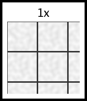

```go
// Tiled floor using Tile pattern?
// We have `NewTile` which tiles an image.
// We have `NewBrick` or `NewGrid`?
// `brick.go` makes bricks.
// `checker.go` makes checks.

// Let's use `NewBrick` for a tile floor.
// Large square tiles.

// Create a marble texture for tiles
marble := NewNoise(SetNoiseAlgorithm(&PerlinNoise{Frequency: 0.1}))
marbleColor := NewColorMap(marble,
	ColorStop{0.0, color.RGBA{220, 220, 220, 255}},
	ColorStop{1.0, color.White},
)

// Create a slightly different marble for variation
marble2 := NewRotate(marbleColor, 90)

mortarColor := NewRect(SetFillColor(color.RGBA{50, 50, 50, 255}))

return NewBrick(
	SetBrickSize(60, 60),
	SetMortarSize(3),
	SetBrickOffset(0),
	SetBrickImages(marbleColor, marble2),
	SetMortarImage(mortarColor),
)
```

---

## Stones


```go
// F2-F1 gives distance to the border.
// Border is 0. Center is High.
noise := NewWorleyNoise(
	SetFrequency(0.02),
	SetSeed(100),
	SetWorleyOutput(OutputF2MinusF1),
	SetWorleyMetric(MetricEuclidean),
)

// Map:
// 0.0 - 0.1: Mortar (Dark)
// 0.1 - 0.3: Edge of stone (Darker Grey)
// 0.3 - 1.0: Stone Body (Grey/Blueish with gradient)

stones := NewColorMap(noise,
	ColorStop{Position: 0.0, Color: color.RGBA{20, 15, 10, 255}},    // Mortar
	ColorStop{Position: 0.15, Color: color.RGBA{40, 40, 45, 255}},   // Stone Edge
	ColorStop{Position: 0.3, Color: color.RGBA{80, 80, 90, 255}},    // Stone Body
	ColorStop{Position: 0.8, Color: color.RGBA{150, 150, 160, 255}}, // Highlight
)

f, err := os.Create(StonesOutputFilename)
if err != nil {
	panic(err)
}
defer func() {
	if e := f.Close(); e != nil {
		panic(e)
	}
}()
if err = png.Encode(f, stones); err != nil {
	panic(err)
}
```

---

## Camouflage


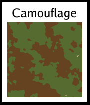

```go
img := GenerateCamouflage(image.Rect(0, 0, 150, 150))
f, err := os.Create(CamouflageOutputFilename)
if err != nil {
	panic(err)
}
defer f.Close()
if err = png.Encode(f, img); err != nil {
	panic(err)
}
```

---

## Damascus


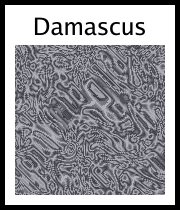

```go
img := GenerateDamascus(image.Rect(0, 0, 150, 150))
f, err := os.Create(DamascusOutputFilename)
if err != nil {
	panic(err)
}
defer f.Close()
if err = png.Encode(f, img); err != nil {
	panic(err)
}
```

---

## Globe_Simple


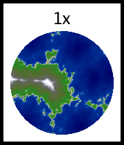

```go
g := GenerateGlobe_Simple(image.Rect(0, 0, 300, 300))
saveImage(Globe_SimpleOutputFilename, g)
```

---

## Globe_Projected


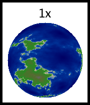

```go
g := GenerateGlobe_Projected(image.Rect(0, 0, 300, 300))
saveImage(Globe_ProjectedOutputFilename, g)
```

---

## Globe_Grid


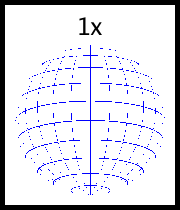

```go
g := GenerateGlobe_Grid(image.Rect(0, 0, 300, 300))
saveImage(Globe_GridOutputFilename, g)
```

---

## Wood


```go
// 1. Wood Palette
// Dark brown (Late wood / Rings) -> Light Tan (Early wood) -> Dark
woodPalette := []ColorStop{
	{0.0, color.RGBA{101, 67, 33, 255}},  // Dark Brown (Ring Edge)
	{0.15, color.RGBA{160, 120, 80, 255}}, // Transition
	{0.5, color.RGBA{222, 184, 135, 255}}, // Light Tan (Center - Burlywood)
	{0.85, color.RGBA{160, 120, 80, 255}}, // Transition
	{1.0, color.RGBA{101, 67, 33, 255}},  // Back to Edge
}

// 2. Base "Heightmap" Generator
// We create a grayscale gradient for rings (0-255).
grayScale := make([]color.Color, 256)
for i := range grayScale {
	grayScale[i] = color.Gray{Y: uint8(i)}
}

// Use ConcentricRings to generate the base distance field.
// We want ~10 rings across the 256px width.
// 256 colors in palette.
// To get 1 cycle every 25 pixels: Freq = 256/25 ≈ 10.
// To get elongated vertical rings, FreqY should be lower (slower change).
ringsBase := NewConcentricRings(grayScale,
	SetCenter(128, -100), // Off-center top
	SetFrequencyX(8.0),   // ~30px width per ring
	SetFrequencyY(0.8),   // Stretched vertically (10x elongation)
)

// 3. Main Distortion (Growth Wobble)
// Low frequency noise to warp the rings.
// Noise values are 0..1 (from NewNoise/Perlin).
// Warp maps intensity to offset.
wobbleNoise := NewNoise(NoiseSeed(101), SetNoiseAlgorithm(&PerlinNoise{
	Frequency: 0.015,
	Octaves: 2,
}))

// Apply warp.
// Scale 20.0 means max offset is +/- 20 pixels.
// Since rings are ~30px wide, this distorts them significantly but keeps structure.
warpedRings := NewWarp(ringsBase,
	WarpDistortion(wobbleNoise),
	WarpScale(20.0),
)

// 4. Fiber Grain (Fine Detail)
// Add "Turbulence" to the warp using higher frequency noise.
// This simulates the jagged edges of the grain.
fiberDistortion := NewNoise(NoiseSeed(303), SetNoiseAlgorithm(&PerlinNoise{
	Frequency: 0.1, // Higher freq
	Octaves: 3,     // More detail
}))

// Chain Warps: WarpedRings -> Warp again with fiber distortion
doubleWarped := NewWarp(warpedRings,
	WarpDistortion(fiberDistortion),
	WarpScale(2.0), // Small jaggedness (2 pixels)
)

// 5. Color Mapping
// Map the grayscale intensity (warped distance) to the wood palette.
finalWood := NewColorMap(doubleWarped, woodPalette...)

return finalWood
```

---

## GridUnbounded


```go
// 300x100 Grid
// Col 0: Bounded (100x100)
// Col 1: Unbounded (Should take remaining 200px)

// bounded := NewChecker(color.Black, color.White) // Checkers default to 255x255 but here we want fixed?
// Actually NewChecker returns default bounds.
// Let's use NewCrop or just standard bounds behavior.
// But `layout()` uses `image.Bounds()` if not `Bounded`.

// Let's create a bounded Mock that is 100x100.
hundred := 100
zero := 0

b := &boundedGopher{
	Image: NewScale(NewGopher(), ScaleToSize(100, 100)),
	bounds: Bounds{
		Left:   &Range{Low: &zero, High: &zero},
		Right:  &Range{Low: &hundred, High: &hundred},
		Top:    &Range{Low: &zero, High: &zero},
		Bottom: &Range{Low: &hundred, High: &hundred},
	},
}

// Unbounded pattern: e.g. a generic Tile or Checker that we want to fill space.
// NewChecker returns 255x255.
// Let's wrap it in an unbounded structure.
u := &unboundedPattern{
	Image: NewChecker(color.RGBA{200, 0, 0, 255}, color.White),
}

args := []any{
	FixedSize(300, 100),
	Row(Cell(b), Cell(u)),
}
for _, op := range ops {
	args = append(args, op)
}

return NewGrid(args...)
```

---

## BooleanAnd


```go
// Gopher AND Horizontal Stripes
g := NewGopher()
// Line: Black (Alpha 1). Space: White (Alpha 1).
h := NewHorizontalLine(SetLineSize(10), SetSpaceSize(10), SetLineColor(color.Black), SetSpaceColor(color.White))

// Default uses component-wise min if no TrueColor/FalseColor set.
i := NewAnd([]image.Image{g, h})

f, err := os.Create(BooleanAndOutputFilename)
if err != nil {
	panic(err)
}
defer func() {
	if e := f.Close(); e != nil {
		panic(e)
	}
}()
if err = png.Encode(f, i); err != nil {
	panic(err)
}
```

---

## MathsMandelbrot


```go
b := image.Rect(0, 0, 150, 150)
img := GenerateMathsMandelbrot(b)
f, err := os.Create(MathsMandelbrotOutputFilename)
if err != nil {
	panic(err)
}
defer f.Close()
if err = png.Encode(f, img); err != nil {
	panic(err)
}
```

---

## BooleanOr


```go
g := NewGopher()
v := NewVerticalLine(SetLineSize(10), SetSpaceSize(10), SetLineColor(color.Black), SetSpaceColor(color.White))

// OR(Gopher, Stripes) -> Max(Gopher, Stripes)
i := NewOr([]image.Image{g, v})

f, err := os.Create(BooleanOrOutputFilename)
if err != nil {
	panic(err)
}
defer func() {
	if e := f.Close(); e != nil {
		panic(e)
	}
}()
if err = png.Encode(f, i); err != nil {
	panic(err)
}
```

---

## MathsJulia


```go
b := image.Rect(0, 0, 150, 150)
img := GenerateMathsJulia(b)
f, err := os.Create(MathsJuliaOutputFilename)
if err != nil {
	panic(err)
}
defer f.Close()
if err = png.Encode(f, img); err != nil {
	panic(err)
}
```

---

## BooleanXor


```go
g := NewGopher()
v := NewVerticalLine(SetLineSize(20), SetSpaceSize(20), SetLineColor(color.Black))

// XOR(Gopher, Stripes)
i := NewXor([]image.Image{g, v}, SetTrueColor(color.RGBA{255, 255, 0, 255}), SetFalseColor(color.Transparent))

f, err := os.Create(BooleanXorOutputFilename)
if err != nil {
	panic(err)
}
defer func() {
	if e := f.Close(); e != nil {
		panic(e)
	}
}()
if err = png.Encode(f, i); err != nil {
	panic(err)
}
```

---

## MathsSine


```go
b := image.Rect(0, 0, 150, 150)
img := GenerateMathsSine(b)
f, err := os.Create(MathsSineOutputFilename)
if err != nil {
	panic(err)
}
defer f.Close()
if err = png.Encode(f, img); err != nil {
	panic(err)
}
```

---

## BooleanNot


```go
g := NewGopher()

// Not Gopher.
// Default component-wise: Invert colors.
i := NewNot(g)

f, err := os.Create(BooleanNotOutputFilename)
if err != nil {
	panic(err)
}
defer func() {
	if e := f.Close(); e != nil {
		panic(e)
	}
}()
if err = png.Encode(f, i); err != nil {
	panic(err)
}
```

---

## MathsWaves


```go
b := image.Rect(0, 0, 150, 150)
img := GenerateMathsWaves(b)
f, err := os.Create(MathsWavesOutputFilename)
if err != nil {
	panic(err)
}
defer f.Close()
if err = png.Encode(f, img); err != nil {
	panic(err)
}
```

---

## XorGrid


```go
p := NewXorPattern()
f, err := os.Create(XorGridOutputFilename)
if err != nil {
	panic(err)
}
defer f.Close()
if err := png.Encode(f, p); err != nil {
	panic(err)
}
```

---

## GradientQuantization


```go
grad := NewLinearGradient(
	SetStartColor(color.Black),
	SetEndColor(color.White),
)
p := NewQuantize(grad, 4)
f, err := os.Create(GradientQuantizationOutputFilename)
if err != nil {
	panic(err)
}
defer f.Close()
if err := png.Encode(f, p); err != nil {
	panic(err)
}
```

---

## DitherStages


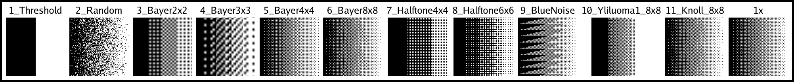

```go
// Default view: Bayer 8x8 on a gradient
return NewBayer8x8Dither(NewLinearGradient(), nil)
```

---

## DitherColorReduction


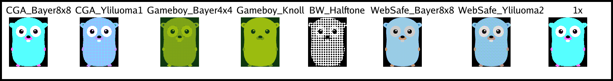

```go
return NewBayer8x8Dither(NewGopher(), PaletteCGA)
```

---
