<!-- Code generated by cmd/bootstrap/main.go; DO NOT EDIT. -->
# go-pattern

`go-pattern` is a collection of pre-created `image.Image` implementations. It provides a variety of ready-to-use patterns that implement the standard Go image interface.

This project is in the early stages, please let me know of use/dependencies.

These patterns are designed to be:
- **Ready to use**: Instantly available as standard `image.Image` objects.
- **Composable**: Easily combined (e.g., zooming, transposing) to form complex visual structures.
- **Standard**: Fully compatible with any Go library that accepts `image.Image`.

## Patterns


### Cells Pattern


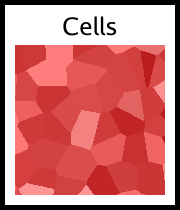

```go
	// F1 Euclidean gives distance to center of cell.
	// We want irregular organic cells.
	noise := NewWorleyNoise(
		SetFrequency(0.02),
		SetSeed(777),
		SetWorleyOutput(OutputF1),
		SetWorleyMetric(MetricEuclidean),
		SetWorleyJitter(0.8), // High jitter for organic look
	)

	// ColorMap:
	// 0.0 - 0.2: Nucleus (Dark Green)
	// 0.2 - 0.25: Nucleus Membrane (Lighter)
	// 0.25 - 0.7: Cytoplasm (Light Green, Translucent look)
	// 0.7 - 0.9: Cell Wall Inner (Darker Green)
	// 0.9 - 1.0: Cell Wall (Thick Dark Border)

	cells := NewColorMap(noise,
		ColorStop{Position: 0.0, Color: color.RGBA{20, 80, 20, 255}},    // Nucleus Center
		ColorStop{Position: 0.18, Color: color.RGBA{40, 100, 40, 255}},  // Nucleus
		ColorStop{Position: 0.20, Color: color.RGBA{100, 180, 100, 255}},// Membrane
		ColorStop{Position: 0.25, Color: color.RGBA{150, 220, 150, 255}},// Cytoplasm Start
		ColorStop{Position: 0.70, Color: color.RGBA{140, 210, 140, 255}},// Cytoplasm End
		ColorStop{Position: 0.85, Color: color.RGBA{50, 120, 50, 255}},  // Wall Inner
		ColorStop{Position: 0.95, Color: color.RGBA{10, 40, 10, 255}},   // Wall Outer
		ColorStop{Position: 1.0, Color: color.RGBA{0, 20, 0, 255}},      // Gap
	)

	f, err := os.Create(CellsOutputFilename)
	if err != nil {
		panic(err)
	}
	defer func() {
		if e := f.Close(); e != nil {
			panic(e)
		}
	}()
	if err = png.Encode(f, cells); err != nil {
		panic(err)
	}
```


### Molecules Pattern


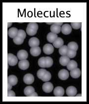

```go
	// Base Worley Noise (F1) provides the cellular structure
	noise := NewWorleyNoise(
		SetFrequency(0.02),
		SetSeed(42),
		SetWorleyOutput(OutputF1),
		SetWorleyMetric(MetricEuclidean),
	)

	// ColorMap:
	// Center (distance 0) -> Light
	// Edge (distance ~0.5) -> Dark
	// Gaps -> Black

	molecules := NewColorMap(noise,
		ColorStop{Position: 0.0, Color: color.RGBA{180, 180, 190, 255}}, // Center
		ColorStop{Position: 0.4, Color: color.RGBA{100, 100, 110, 255}}, // Edge
		ColorStop{Position: 0.45, Color: color.RGBA{50, 50, 55, 255}},   // Darker edge
		ColorStop{Position: 0.5, Color: color.RGBA{10, 10, 10, 255}},    // Gap
		ColorStop{Position: 1.0, Color: color.RGBA{0, 0, 0, 255}},       // Deep gap
	)

	f, err := os.Create(MoleculesOutputFilename)
	if err != nil {
		panic(err)
	}
	defer func() {
		if e := f.Close(); e != nil {
			panic(e)
		}
	}()
	if err = png.Encode(f, molecules); err != nil {
		panic(err)
	}
```


### Warp_marble Pattern


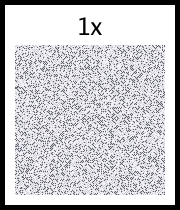

```go
	colors := []color.Color{
		color.RGBA{240, 240, 245, 255},
		color.RGBA{240, 240, 245, 255},
		color.RGBA{240, 240, 245, 255},
		color.RGBA{200, 200, 210, 255},
		color.RGBA{100, 100, 110, 255},
		color.RGBA{200, 200, 210, 255},
	}
	stripes := NewModuloStripe(colors)

	noise := NewNoise(NoiseSeed(456), SetNoiseAlgorithm(&PerlinNoise{
		Frequency: 0.04,
		Octaves: 4,
		Persistence: 0.6,
	}))

	return NewWarp(stripes,
		WarpDistortion(noise),
		WarpScale(30.0),
	)
```


### Grass Pattern


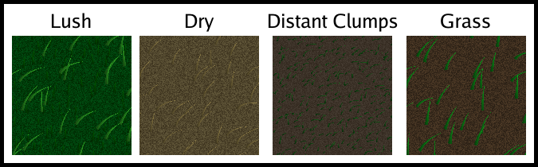

```go
	// 1. Create a base noise layer for general color variation.
	baseNoise := NewNoise(
		SetNoiseAlgorithm(&PerlinNoise{
			Seed:        500,
			Frequency:   0.02,
			Octaves:     4,
			Persistence: 0.5,
			Lacunarity:  2.0,
		}),
	)

	// 2. Create a high-frequency noise layer for "blades" or detail.
	detailNoise := NewNoise(
		SetNoiseAlgorithm(&PerlinNoise{
			Seed:        600,
			Frequency:   0.2, // High frequency for grass blades
			Octaves:     2,
			Persistence: 0.5,
			Lacunarity:  2.0,
		}),
	)

	// 3. Blend them. We want the detail to be prominent but influenced by the base.
	// Multiply might darken too much, let's use Overlay or just simple addition/average.
	// Actually, let's just use the detail noise warped by base noise for a wind-blown look?
	// Or simply blend them.

	// Let's try blending: Base * 0.5 + Detail * 0.5
	// Using BlendAverage is simple.
	blended := NewBlend(baseNoise, detailNoise, BlendAverage)

	// 4. Map to Grass Colors.
	grass := NewColorMap(blended,
		ColorStop{Position: 0.0, Color: color.RGBA{10, 40, 10, 255}},    // Deep shadow/dirt
		ColorStop{Position: 0.3, Color: color.RGBA{30, 80, 30, 255}},    // Dark Grass
		ColorStop{Position: 0.6, Color: color.RGBA{60, 140, 40, 255}},   // Mid Grass
		ColorStop{Position: 0.8, Color: color.RGBA{100, 180, 60, 255}},  // Light Grass
		ColorStop{Position: 1.0, Color: color.RGBA{140, 220, 100, 255}}, // Tips/Highlights
	)

	f, err := os.Create(GrassOutputFilename)
	if err != nil {
		panic(err)
	}
	defer func() {
		if e := f.Close(); e != nil {
			panic(e)
		}
	}()
	if err = png.Encode(f, grass); err != nil {
		panic(err)
	}
```


### Tile Pattern


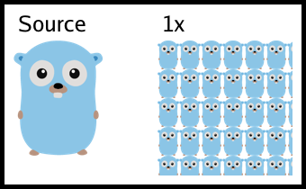

```go
	gopher := NewScale(NewGopher(), ScaleToRatio(0.25))
	// Tile the gopher in a 200x200 area
	return NewTile(gopher, image.Rect(0, 0, 200, 200))
```


### CrossHatch Pattern


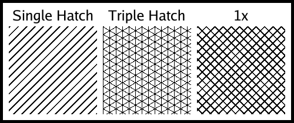

```go
	// This function body is empty because the bootstrap tool uses the function signature
	// and the following variable to generate the documentation and image.
```


### Warp_wood Pattern


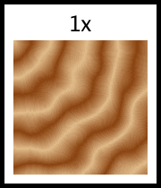

```go
	woodLight := color.RGBA{222, 184, 135, 255}
	woodDark := color.RGBA{139, 69, 19, 255}

	colors := []color.Color{}
	steps := 20
	for i := 0; i < steps; i++ {
		t := float64(i) / float64(steps-1)
		r := uint8(float64(woodLight.R)*(1-t) + float64(woodDark.R)*t)
		g := uint8(float64(woodLight.G)*(1-t) + float64(woodDark.G)*t)
		b := uint8(float64(woodLight.B)*(1-t) + float64(woodDark.B)*t)
		colors = append(colors, color.RGBA{r, g, b, 255})
	}
	for i := steps - 1; i >= 0; i-- {
		colors = append(colors, colors[i])
	}

	rings := NewConcentricRings(colors)

	noiseLow := NewNoise(NoiseSeed(123), SetNoiseAlgorithm(&PerlinNoise{
		Frequency: 0.02,
		Octaves: 2,
	}))

	// Apply Warp
	return NewWarp(rings,
		WarpDistortion(noiseLow),
		WarpScale(15.0),
	)
```


### ScreenTone Pattern


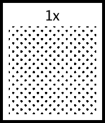

```go
	i := NewScreenTone(
		SetRadius(3),
		SetSpacing(10),
		SetAngle(45),
		SetFillColor(color.Black),
		SetSpaceColor(color.White),
	)
	f, err := os.Create(ScreenToneOutputFilename)
	if err != nil {
		panic(err)
	}
	defer func() {
		if e := f.Close(); e != nil {
			panic(e)
		}
	}()
	if err = png.Encode(f, i); err != nil {
		panic(err)
	}
```


### Stones Pattern


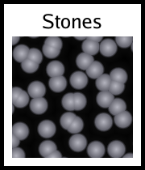

```go
	// F2-F1 gives distance to the border.
	// Border is 0. Center is High.
	noise := NewWorleyNoise(
		SetFrequency(0.02),
		SetSeed(100),
		SetWorleyOutput(OutputF2MinusF1),
		SetWorleyMetric(MetricEuclidean),
	)

	// Map:
	// 0.0 - 0.1: Mortar (Dark)
	// 0.1 - 0.3: Edge of stone (Darker Grey)
	// 0.3 - 1.0: Stone Body (Grey/Blueish with gradient)

	stones := NewColorMap(noise,
		ColorStop{Position: 0.0, Color: color.RGBA{20, 15, 10, 255}},    // Mortar
		ColorStop{Position: 0.15, Color: color.RGBA{40, 40, 45, 255}},   // Stone Edge
		ColorStop{Position: 0.3, Color: color.RGBA{80, 80, 90, 255}},    // Stone Body
		ColorStop{Position: 0.8, Color: color.RGBA{150, 150, 160, 255}}, // Highlight
	)

	f, err := os.Create(StonesOutputFilename)
	if err != nil {
		panic(err)
	}
	defer func() {
		if e := f.Close(); e != nil {
			panic(e)
		}
	}()
	if err = png.Encode(f, stones); err != nil {
		panic(err)
	}
```


### WorleyNoise Pattern


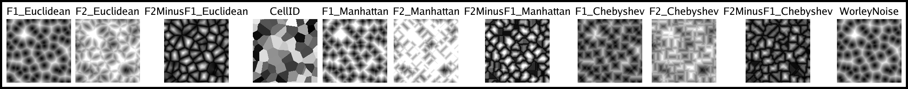

```go
	// Standard F1 Euclidean Worley Noise
	i := NewWorleyNoise(
		SetFrequency(0.05),
		SetSeed(1),
	)
	f, err := os.Create(WorleyNoiseOutputFilename)
	if err != nil {
		panic(err)
	}
	defer func() {
		if e := f.Close(); e != nil {
			panic(e)
		}
	}()
	if err = png.Encode(f, i); err != nil {
		panic(err)
	}
```


### Pebbles Pattern


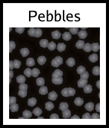

```go
	// Re-implement Pebbles using Scatter for true overlapping geometry.
	pebbles := NewScatter(
		SetScatterFrequency(0.04), // Size control
		SetScatterDensity(1.0),    // Packed tight
		SetScatterMaxOverlap(1),
		SetScatterGenerator(func(u, v float64, hash uint64) (color.Color, float64) {
			// Randomize size slightly
			rSize := float64(hash&0xFF)/255.0
			radius := 12.0 + rSize*6.0 // 12 to 18 pixels radius

			// Perturb the shape using simple noise (simulated by sin/cos of hash+angle)
			// to make it "chipped" or irregular.
			angle := math.Atan2(v, u)
			dist := math.Sqrt(u*u + v*v)

			// Simple radial noise
			noise := math.Sin(angle*5 + float64(hash%10)) * 0.1
			noise += math.Cos(angle*13 + float64(hash%7)) * 0.05

			effectiveRadius := radius * (1.0 + noise)

			if dist > effectiveRadius {
				return color.Transparent, 0
			}

			// Stone Color: Grey/Brown variations
			grey := 100 + int(hash%100)
			col := color.RGBA{uint8(grey), uint8(grey - 5), uint8(grey - 10), 255}

			// Shading (diffuse)
			// Normal estimation for a flattened spheroid
			nx := u / effectiveRadius
			ny := v / effectiveRadius
			nz := math.Sqrt(math.Max(0, 1.0 - nx*nx - ny*ny))

			// Light dir
			lx, ly, lz := -0.5, -0.5, 0.7
			lLen := math.Sqrt(lx*lx + ly*ly + lz*lz)
			lx, ly, lz = lx/lLen, ly/lLen, lz/lLen

			diffuse := math.Max(0, nx*lx + ny*ly + nz*lz)

			// Apply shading
			r := float64(col.R) * (0.1 + 0.9*diffuse)
			g := float64(col.G) * (0.1 + 0.9*diffuse)
			b := float64(col.B) * (0.1 + 0.9*diffuse)

			// Soft edge anti-aliasing
			alpha := 1.0
			edgeDist := effectiveRadius - dist
			if edgeDist < 1.0 {
				alpha = edgeDist
			}

			// Use hash for random Z-ordering
			z := float64(hash) / 18446744073709551615.0

			return color.RGBA{
				R: uint8(math.Min(255, r)),
				G: uint8(math.Min(255, g)),
				B: uint8(math.Min(255, b)),
				A: uint8(alpha * 255),
			}, z
		}),
	)

	f, err := os.Create(PebblesOutputFilename)
	if err != nil {
		panic(err)
	}
	defer func() {
		if e := f.Close(); e != nil {
			panic(e)
		}
	}()
	if err = png.Encode(f, pebbles); err != nil {
		panic(err)
	}
```


### CrackedMud Pattern


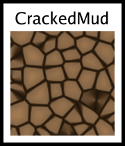

```go
	// F2-F1 gives thick lines at cell boundaries (where distance to 1st and 2nd closest points are similar)
	noise := NewWorleyNoise(
		SetFrequency(0.02),
		SetSeed(123),
		SetWorleyOutput(OutputF2MinusF1),
		SetWorleyMetric(MetricEuclidean),
	)

	// Map distance to mud colors.
	// Low value (close to 0) means F1 ~= F2, i.e., boundary/crack.
	// High value means center of cell.

	mud := NewColorMap(noise,
		ColorStop{Position: 0.0, Color: color.RGBA{30, 20, 10, 255}},    // Crack (Dark brown/black)
		ColorStop{Position: 0.1, Color: color.RGBA{60, 40, 20, 255}},    // Crack edge
		ColorStop{Position: 0.2, Color: color.RGBA{130, 100, 70, 255}},  // Mud surface
		ColorStop{Position: 1.0, Color: color.RGBA{160, 120, 80, 255}},  // Center of mud chunk
	)

	f, err := os.Create(CrackedMudOutputFilename)
	if err != nil {
		panic(err)
	}
	defer func() {
		if e := f.Close(); e != nil {
			panic(e)
		}
	}()
	if err = png.Encode(f, mud); err != nil {
		panic(err)
	}
```


### Null Pattern


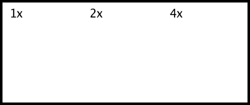

```go
	i := NewNull()
	f, err := os.Create(NullOutputFilename)
	if err != nil {
		panic(err)
	}
	defer func() {
		if e := f.Close(); e != nil {
			panic(e)
		}
	}()
	if err = png.Encode(f, i); err != nil {
		panic(err)
	}
```


### Polka Pattern


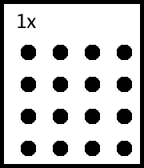

```go
	i := NewPolka(
		SetRadius(10),
		SetSpacing(40),
		SetFillColor(color.Black),
		SetSpaceColor(color.White),
	)
	f, err := os.Create(PolkaOutputFilename)
	if err != nil {
		panic(err)
	}
	defer func() {
		if e := f.Close(); e != nil {
			panic(e)
		}
	}()
	if err = png.Encode(f, i); err != nil {
		panic(err)
	}
```


### Shojo_blue Pattern


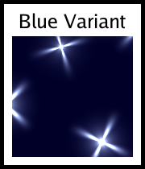

```go
	return NewShojo(
		SetSpaceColor(color.RGBA{0, 0, 40, 255}), // Dark blue bg
		SetFillColor(color.RGBA{200, 220, 255, 255}), // Blueish sparkles
	)
```


### Warp Pattern


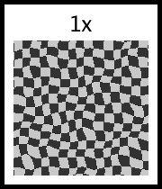

```go
	// Standard demo: Grid warped by noise
	// We want a visual that clearly shows the warping effect.
	// A checkerboard is good.

	checker := NewChecker(
		color.RGBA{200, 200, 200, 255},
		color.RGBA{50, 50, 50, 255},
	)

	// Distortion noise
	noise := NewNoise(NoiseSeed(99), SetNoiseAlgorithm(&PerlinNoise{
		Frequency: 0.03,
		Octaves: 2,
	}))

	// Apply Warp
	warped := NewWarp(checker,
		WarpDistortion(noise),
		WarpScale(10.0),
	)

	fmt.Println(warped.At(10, 10))
	// Output: {50 50 50 255}
```


### Wood Pattern


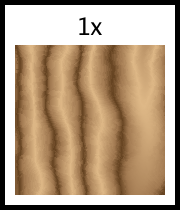

```go
	// 1. Wood Palette
	// Dark brown (Late wood / Rings) -> Light Tan (Early wood) -> Dark
	woodPalette := []ColorStop{
		{0.0, color.RGBA{101, 67, 33, 255}},  // Dark Brown (Ring Edge)
		{0.15, color.RGBA{160, 120, 80, 255}}, // Transition
		{0.5, color.RGBA{222, 184, 135, 255}}, // Light Tan (Center - Burlywood)
		{0.85, color.RGBA{160, 120, 80, 255}}, // Transition
		{1.0, color.RGBA{101, 67, 33, 255}},  // Back to Edge
	}

	// 2. Base "Heightmap" Generator
	// We create a grayscale gradient for rings (0-255).
	grayScale := make([]color.Color, 256)
	for i := range grayScale {
		grayScale[i] = color.Gray{Y: uint8(i)}
	}

	// Use ConcentricRings to generate the base distance field.
	// We want ~10 rings across the 256px width.
	// 256 colors in palette.
	// To get 1 cycle every 25 pixels: Freq = 256/25 ≈ 10.
	// To get elongated vertical rings, FreqY should be lower (slower change).
	ringsBase := NewConcentricRings(grayScale,
		SetCenter(128, -100), // Off-center top
		SetFrequencyX(8.0),   // ~30px width per ring
		SetFrequencyY(0.8),   // Stretched vertically (10x elongation)
	)

	// 3. Main Distortion (Growth Wobble)
	// Low frequency noise to warp the rings.
	// Noise values are 0..1 (from NewNoise/Perlin).
	// Warp maps intensity to offset.
	wobbleNoise := NewNoise(NoiseSeed(101), SetNoiseAlgorithm(&PerlinNoise{
		Frequency: 0.015,
		Octaves: 2,
	}))

	// Apply warp.
	// Scale 20.0 means max offset is +/- 20 pixels.
	// Since rings are ~30px wide, this distorts them significantly but keeps structure.
	warpedRings := NewWarp(ringsBase,
		WarpDistortion(wobbleNoise),
		WarpScale(20.0),
	)

	// 4. Fiber Grain (Fine Detail)
	// Add "Turbulence" to the warp using higher frequency noise.
	// This simulates the jagged edges of the grain.
	fiberDistortion := NewNoise(NoiseSeed(303), SetNoiseAlgorithm(&PerlinNoise{
		Frequency: 0.1, // Higher freq
		Octaves: 3,     // More detail
	}))

	// Chain Warps: WarpedRings -> Warp again with fiber distortion
	doubleWarped := NewWarp(warpedRings,
		WarpDistortion(fiberDistortion),
		WarpScale(2.0), // Small jaggedness (2 pixels)
	)

	// 5. Color Mapping
	// Map the grayscale intensity (warped distance) to the wood palette.
	finalWood := NewColorMap(doubleWarped, woodPalette...)

	return finalWood
```


### Shojo_pink Pattern


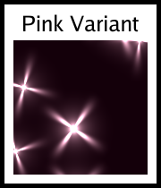

```go
	return NewShojo(
		SetSpaceColor(color.RGBA{20, 0, 10, 255}), // Dark red/brown bg
		SetFillColor(color.RGBA{255, 200, 220, 255}), // Pink sparkles
	)
```


### Shojo Pattern


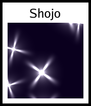

```go
	return NewShojo(ops...)
```


### Warp_terrain Pattern


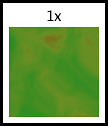

```go
	fbm := func(seed int64) image.Image {
		return NewNoise(NoiseSeed(seed), SetNoiseAlgorithm(&PerlinNoise{
			Frequency: 0.015,
			Octaves: 6,
			Persistence: 0.5,
			Lacunarity: 2.0,
		}))
	}

	base := fbm(101)

	warp := NewNoise(NoiseSeed(202), SetNoiseAlgorithm(&PerlinNoise{
		Frequency: 0.01,
		Octaves: 2,
	}))

	warped := NewWarp(base,
		WarpDistortion(warp),
		WarpScale(80.0),
	)

	stops := []ColorStop{
		{0.0, color.RGBA{0, 0, 150, 255}},
		{0.2, color.RGBA{0, 50, 200, 255}},
		{0.22, color.RGBA{240, 230, 140, 255}},
		{0.3, color.RGBA{34, 139, 34, 255}},
		{0.6, color.RGBA{107, 142, 35, 255}},
		{0.8, color.RGBA{139, 69, 19, 255}},
		{0.9, color.RGBA{100, 100, 100, 255}},
		{0.98, color.RGBA{255, 250, 250, 255}},
	}

	return NewColorMap(warped, stops...)
```


### Brick Pattern


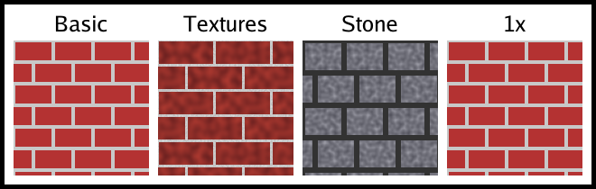

```go
	return NewBrick(
		SetBrickSize(50, 20),
		SetMortarSize(4),
	)
```


### GrassClose Pattern


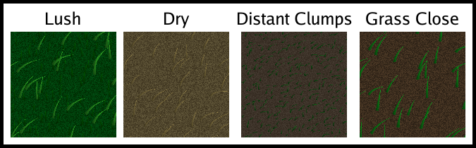

```go
	// 1. Background: Dirt
	dirt := NewColorMap(
		NewNoise(SetFrequency(0.05), NoiseSeed(1)),
		ColorStop{0.0, color.RGBA{40, 30, 20, 255}},
		ColorStop{1.0, color.RGBA{80, 60, 40, 255}},
	)

	// 2. Wind map (Perlin noise)
	wind := NewNoise(
		SetFrequency(0.01),
		NoiseSeed(2),
		SetNoiseAlgorithm(&PerlinNoise{Seed: 2, Octaves: 2, Persistence: 0.5}),
	)

	// 3. Density map (Worley noise for clumping)
	density := NewWorleyNoise(
		SetFrequency(0.02),
		SetSeed(3),
	)

	// 4. Grass Layer
	grass := NewGrassClose(
		SetBladeHeight(35),
		SetBladeWidth(5),
		SetFillColor(color.RGBA{20, 160, 30, 255}),
		SetWindSource(wind),
		SetDensitySource(density),
		// Background source
		func(p any) {
			if g, ok := p.(*GrassClose); ok {
				g.Source = dirt
			}
		},
	)

	f, err := os.Create(GrassCloseOutputFilename)
	if err != nil {
		panic(err)
	}
	defer func() {
		if e := f.Close(); e != nil {
			panic(e)
		}
	}()
	if err = png.Encode(f, grass); err != nil {
		panic(err)
	}
```


### Scales Pattern


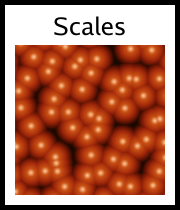

```go
	// Use the explicit Scales pattern for proper overlapping geometry.
	// Radius 40, SpacingX 40 (touching horizontally), SpacingY 20 (half-overlap vertically).
	pattern := NewScales(
		SetScaleRadius(40),
		SetScaleXSpacing(40),
		SetScaleYSpacing(25),
	)

	// The Scales pattern returns a heightmap (0 edge, 1 center).
	// We want to map this to look like a tough fish scale.
	// Center: Shiny/Metallic
	// Gradient towards edge.
	// Edge: Dark border.

	scales := NewColorMap(pattern,
		ColorStop{Position: 0.0, Color: color.RGBA{10, 10, 10, 255}},    // Deep edge (overlap shadow)
		ColorStop{Position: 0.2, Color: color.RGBA{40, 40, 30, 255}},    // Rim
		ColorStop{Position: 0.5, Color: color.RGBA{100, 100, 80, 255}},  // Body
		ColorStop{Position: 0.8, Color: color.RGBA{160, 150, 120, 255}}, // Highlight start
		ColorStop{Position: 1.0, Color: color.RGBA{200, 190, 160, 255}}, // Peak Highlight
	)

	f, err := os.Create(ScalesOutputFilename)
	if err != nil {
		panic(err)
	}
	defer func() {
		if e := f.Close(); e != nil {
			panic(e)
		}
	}()
	if err = png.Encode(f, scales); err != nil {
		panic(err)
	}
```


### Warp_clouds Pattern


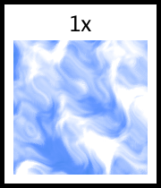

```go
	baseNoise := NewNoise(NoiseSeed(777), SetNoiseAlgorithm(&PerlinNoise{
		Frequency: 0.02,
		Octaves: 4,
		Persistence: 0.5,
	}))

	warpNoise := NewNoise(NoiseSeed(888), SetNoiseAlgorithm(&PerlinNoise{
		Frequency: 0.02,
		Octaves: 2,
	}))

	warped := NewWarp(baseNoise,
		WarpDistortion(warpNoise),
		WarpScale(50.0),
	)

	stops := []ColorStop{
		{0.0, color.RGBA{0, 100, 200, 255}},
		{0.4, color.RGBA{100, 150, 255, 255}},
		{0.6, color.RGBA{255, 255, 255, 255}},
		{1.0, color.RGBA{255, 255, 255, 255}},
	}

	return NewColorMap(warped, stops...)
```


### Voronoi Pattern


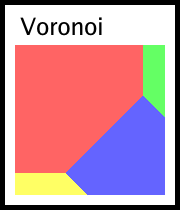

```go
	// Define some points and colors
	points := []image.Point{
		{50, 50}, {200, 50}, {125, 125}, {50, 200}, {200, 200},
	}
	colors := []color.Color{
		color.RGBA{255, 100, 100, 255},
		color.RGBA{100, 255, 100, 255},
		color.RGBA{100, 100, 255, 255},
		color.RGBA{255, 255, 100, 255},
		color.RGBA{100, 255, 255, 255},
	}

	i := NewVoronoi(points, colors)
	f, err := os.Create(VoronoiOutputFilename)
	if err != nil {
		panic(err)
	}
	defer func() {
		if e := f.Close(); e != nil {
			panic(e)
		}
	}()
	if err = png.Encode(f, i); err != nil {
		panic(err)
	}
```


### Brick_textures Pattern


```go
	// Bricks with variations
	// Create 3 variations of brick textures using Noise
	var bricks []image.Image
	for i := 0; i < 3; i++ {
		// Noise with different seeds to ensure different texture per variant
		noise := NewNoise(SetNoiseAlgorithm(&PerlinNoise{
			Seed:      int64(i*100 + 1),
			Frequency: 0.1,
		}))

		// Tint the noise red/brown
		colored := NewColorMap(noise,
			ColorStop{0.0, color.RGBA{100, 30, 30, 255}},
			ColorStop{1.0, color.RGBA{180, 60, 50, 255}},
		)
		bricks = append(bricks, colored)
	}

	// Mortar texture: grey noise
	mortar := NewColorMap(
		NewNoise(SetNoiseAlgorithm(&PerlinNoise{
			Seed:      999,
			Frequency: 0.5,
		})),
		ColorStop{0.0, color.RGBA{180, 180, 180, 255}},
		ColorStop{1.0, color.RGBA{220, 220, 220, 255}},
	)

	return NewBrick(
		SetBrickSize(60, 25),
		SetMortarSize(3),
		SetBrickImages(bricks...),
		SetMortarImage(mortar),
	)
```


### Brick_stone Pattern


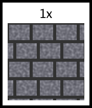

```go
	// Create "Stone" textures
	var stones []image.Image
	for i := 0; i < 4; i++ {
		noise := NewNoise(SetNoiseAlgorithm(&PerlinNoise{
			Seed:      int64(i*50 + 123),
			Frequency: 0.2,
		}))
		// Grey/Blueish stone colors
		colored := NewColorMap(noise,
			ColorStop{0.0, color.RGBA{80, 80, 90, 255}},
			ColorStop{0.6, color.RGBA{120, 120, 130, 255}},
			ColorStop{1.0, color.RGBA{160, 160, 170, 255}},
		)
		stones = append(stones, colored)
	}

	mortar := NewUniform(color.RGBA{50, 50, 50, 255})

	// Larger bricks/stones
	return NewBrick(
		SetBrickSize(40, 30),
		SetMortarSize(6),
		SetBrickImages(stones...),
		SetMortarImage(mortar),
		SetBrickOffset(0.3), // Non-standard offset
	)
```


### Islands Pattern


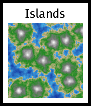

```go
	// Layer 1: Base Shape (Worley F1 Euclidean) - Large distinct landmasses
	baseShape := NewWorleyNoise(
		SetFrequency(0.01),
		SetSeed(555),
		SetWorleyOutput(OutputF1),
		SetWorleyMetric(MetricEuclidean),
	)

	// Layer 2: Detail (Perlin Noise) - Adds coastline complexity and terrain roughness
	detail := NewNoise(
		SetNoiseAlgorithm(&PerlinNoise{
			Seed:        123,
			Frequency:   0.05,
			Octaves:     4,
			Persistence: 0.5,
			Lacunarity:  2.0,
		}),
	)

	// Blend: Subtract detail from base shape? Or Overlay?
	// Worley F1 is 0 at center (Peak), 1 at edge (Deep Water).
	// We want Peaks to be high (1.0). So let's Invert Worley first?
	// Or just use ColorMap on the result.
	// If we Add detail to Worley, the values increase.
	// Let's use BlendOverlay to mix the gradients.

	mixed := NewBlend(baseShape, detail, BlendOverlay)

	// ColorMap:
	// Worley: 0 (Peak) -> 1 (Edge)
	// Overlay tends to push contrast.
	// Let's define:
	// 0.0 - 0.2: Snow (Peak)
	// 0.2 - 0.4: Mountain/Rock
	// 0.4 - 0.5: Forest
	// 0.5 - 0.6: Sand
	// 0.6 - 1.0: Water

	islands := NewColorMap(mixed,
		ColorStop{Position: 0.0, Color: color.RGBA{250, 250, 250, 255}}, // Snow
		ColorStop{Position: 0.15, Color: color.RGBA{120, 120, 120, 255}}, // Rock
		ColorStop{Position: 0.30, Color: color.RGBA{34, 139, 34, 255}},  // Forest
		ColorStop{Position: 0.50, Color: color.RGBA{210, 180, 140, 255}}, // Sand
		ColorStop{Position: 0.55, Color: color.RGBA{64, 164, 223, 255}}, // Water
		ColorStop{Position: 1.0, Color: color.RGBA{0, 0, 128, 255}},     // Deep Water
	)

	f, err := os.Create(IslandsOutputFilename)
	if err != nil {
		panic(err)
	}
	defer func() {
		if e := f.Close(); e != nil {
			panic(e)
		}
	}()
	if err = png.Encode(f, islands); err != nil {
		panic(err)
	}
```


### Candy Pattern


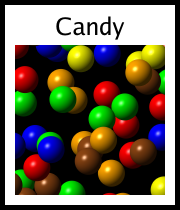

```go
	// 1. Define colors for our candy.
	colors := []color.RGBA{
		{255, 0, 0, 255},     // Red
		{0, 255, 0, 255},     // Green
		{0, 0, 255, 255},     // Blue
		{255, 255, 0, 255},   // Yellow
		{255, 165, 0, 255},   // Orange
		{139, 69, 19, 255},   // Brown
	}

	// 2. Create the Scatter pattern.
	candy := NewScatter(
		SetScatterFrequency(0.04), // Controls size/spacing relative to pixels
		SetScatterDensity(0.9),    // High density
		SetScatterGenerator(func(u, v float64, hash uint64) (color.Color, float64) {
			// Radius of the candy
			radius := 14.0

			// Distance from center
			distSq := u*u + v*v
			if distSq > radius*radius {
				return color.Transparent, 0
			}
			dist := math.Sqrt(distSq)

			// Pick a random color based on hash
			colIdx := hash % uint64(len(colors))
			baseCol := colors[colIdx]

			// Simple shading: slightly darker at edges, highlight at top-left
			// Spherical shading approx
			// Normal vector (nx, ny, nz)
			// z = sqrt(1 - x^2 - y^2)
			nx := u / radius
			ny := v / radius
			nz := math.Sqrt(math.Max(0, 1.0 - nx*nx - ny*ny))

			// Light source direction (top-left)
			lx, ly, lz := -0.5, -0.5, 0.7
			lLen := math.Sqrt(lx*lx + ly*ly + lz*lz)
			lx, ly, lz = lx/lLen, ly/lLen, lz/lLen

			// Diffuse
			dot := nx*lx + ny*ly + nz*lz
			diffuse := math.Max(0, dot)

			// Specular (Glossy plastic look)
			// Reflected light vector
			// R = 2(N.L)N - L
			rx := 2*dot*nx - lx
			ry := 2*dot*ny - ly
			rz := 2*dot*nz - lz
			// View vector (straight up)
			vx, vy, vz := 0.0, 0.0, 1.0
			specDot := rx*vx + ry*vy + rz*vz
			specular := math.Pow(math.Max(0, specDot), 20) // Shininess

			// Apply lighting
			r := float64(baseCol.R) * (0.2 + 0.8*diffuse) + 255*specular*0.6
			g := float64(baseCol.G) * (0.2 + 0.8*diffuse) + 255*specular*0.6
			b := float64(baseCol.B) * (0.2 + 0.8*diffuse) + 255*specular*0.6

			// Clamp
			r = math.Min(255, math.Max(0, r))
			g = math.Min(255, math.Max(0, g))
			b = math.Min(255, math.Max(0, b))

			// Anti-aliasing at edge
			alpha := 1.0
			if dist > radius - 1.0 {
				alpha = radius - dist
			}

			// Use hash for random Z-ordering
			z := float64(hash) / 18446744073709551615.0

			return color.RGBA{
				R: uint8(r),
				G: uint8(g),
				B: uint8(b),
				A: uint8(alpha * 255),
			}, z
		}),
	)

	f, err := os.Create(CandyOutputFilename)
	if err != nil {
		panic(err)
	}
	defer func() {
		if e := f.Close(); e != nil {
			panic(e)
		}
	}()
	if err = png.Encode(f, candy); err != nil {
		panic(err)
	}
```


### Checker Pattern


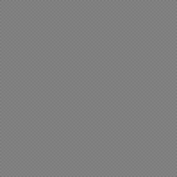

```go
	i := NewChecker(color.Black, color.White)
	f, err := os.Create(CheckerOutputFilename)
	if err != nil {
		panic(err)
	}
	defer func() {
		if e := f.Close(); e != nil {
			panic(e)
		}
	}()
	if err = png.Encode(f, i); err != nil {
		panic(err)
	}
```


### Grid Pattern


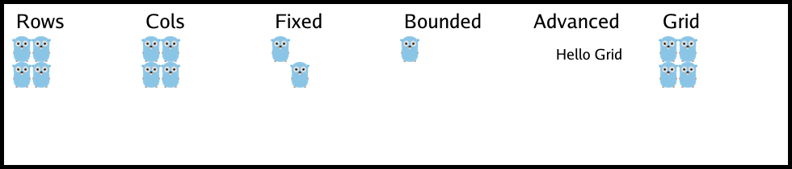

```go
	// Example 1: Simple 2x2 grid with Gophers
	// Shrink the Gopher so it fits better
	gopher := NewScale(NewGopher(), ScaleToRatio(0.25))

	args := []any{
		Row(Cell(gopher), Cell(gopher)),
		Row(Cell(gopher), Cell(gopher)),
	}
	for _, op := range ops {
		args = append(args, op)
	}

	// Create a grid with explicit Rows
	return NewGrid(args...)
```


### GridUnbounded Pattern


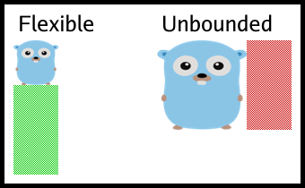

```go
	// 300x100 Grid
	// Col 0: Bounded (100x100)
	// Col 1: Unbounded (Should take remaining 200px)

	// bounded := NewChecker(color.Black, color.White) // Checkers default to 255x255 but here we want fixed?
	// Actually NewChecker returns default bounds.
	// Let's use NewCrop or just standard bounds behavior.
	// But `layout()` uses `image.Bounds()` if not `Bounded`.

	// Let's create a bounded Mock that is 100x100.
	hundred := 100
	zero := 0

	b := &boundedGopher{
		Image: NewScale(NewGopher(), ScaleToSize(100, 100)),
		bounds: Bounds{
			Left:   &Range{Low: &zero, High: &zero},
			Right:  &Range{Low: &hundred, High: &hundred},
			Top:    &Range{Low: &zero, High: &zero},
			Bottom: &Range{Low: &hundred, High: &hundred},
		},
	}

	// Unbounded pattern: e.g. a generic Tile or Checker that we want to fill space.
	// NewChecker returns 255x255.
	// Let's wrap it in an unbounded structure.
	u := &unboundedPattern{
		Image: NewChecker(color.RGBA{200, 0, 0, 255}, color.White),
	}

	args := []any{
		FixedSize(300, 100),
		Row(Cell(b), Cell(u)),
	}
	for _, op := range ops {
		args = append(args, op)
	}

	return NewGrid(args...)
```


### Padding Pattern


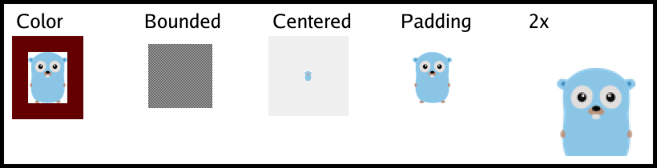

```go
	gopher := NewScale(NewGopher(), ScaleToRatio(0.5))
	// Padding with transparent background (nil)
	return NewPadding(gopher, PaddingMargin(20))
```


### HorizontalLine Pattern


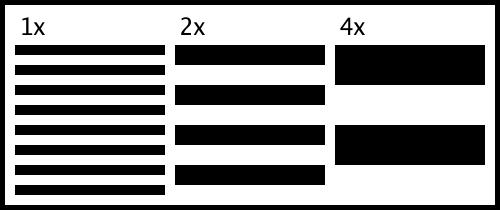

```go
	i := NewHorizontalLine(
		SetLineSize(5),
		SetSpaceSize(5),
		SetLineColor(color.RGBA{255, 0, 0, 255}),
		SetSpaceColor(color.White),
	)
	f, err := os.Create(HorizontalLineOutputFilename)
	if err != nil {
		panic(err)
	}
	defer func() {
		if e := f.Close(); e != nil {
			panic(e)
		}
	}()
	if err = png.Encode(f, i); err != nil {
		panic(err)
	}
```


### VerticalLine Pattern


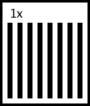

```go
	i := NewVerticalLine(
		SetLineSize(5),
		SetSpaceSize(5),
		SetLineColor(color.RGBA{0, 0, 255, 255}),
		SetSpaceColor(color.White),
	)
	f, err := os.Create(VerticalLineOutputFilename)
	if err != nil {
		panic(err)
	}
	defer func() {
		if e := f.Close(); e != nil {
			panic(e)
		}
	}()
	if err = png.Encode(f, i); err != nil {
		panic(err)
	}
```


### Rect Pattern


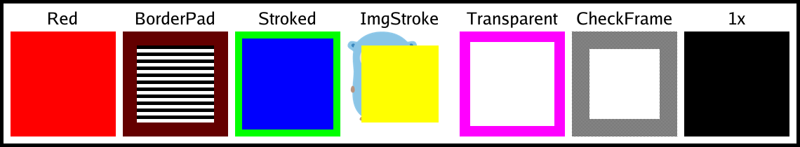

```go
	// A simple black rectangle (default)
	i := NewRect()
	// Output:

	// Create the file for the example
	f, err := os.Create(RectOutputFilename)
	if err != nil {
		panic(err)
	}
	defer func() {
		if e := f.Close(); e != nil {
			panic(e)
		}
	}()
	if err = png.Encode(f, i); err != nil {
		panic(err)
	}
```


### BooleanAnd Pattern


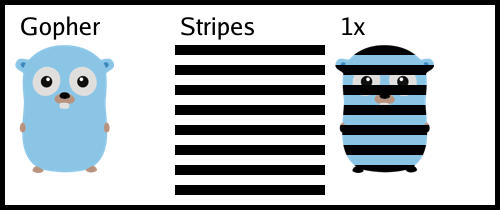

```go
	// Gopher AND Horizontal Stripes
	g := NewGopher()
	// Line: Black (Alpha 1). Space: White (Alpha 1).
	h := NewHorizontalLine(SetLineSize(10), SetSpaceSize(10), SetLineColor(color.Black), SetSpaceColor(color.White))

	// Default uses component-wise min if no TrueColor/FalseColor set.
	i := NewAnd([]image.Image{g, h})

	f, err := os.Create(BooleanAndOutputFilename)
	if err != nil {
		panic(err)
	}
	defer func() {
		if e := f.Close(); e != nil {
			panic(e)
		}
	}()
	if err = png.Encode(f, i); err != nil {
		panic(err)
	}
```


### Gopher Pattern


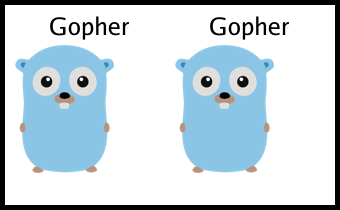

```go
	i := NewGopher()
	f, err := os.Create(GopherOutputFilename)
	if err != nil {
		panic(err)
	}
	defer func() {
		if e := f.Close(); e != nil {
			panic(e)
		}
	}()
	if err = png.Encode(f, i); err != nil {
		panic(err)
	}
```


### Noise Pattern


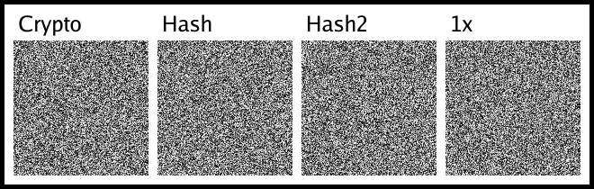

```go
	// Create a noise pattern with a seeded algorithm (Hash) for stability
	i := NewNoise(NoiseSeed(1))
	f, err := os.Create(NoiseOutputFilename)
	if err != nil {
		panic(err)
	}
	defer func() {
		if e := f.Close(); e != nil {
			panic(e)
		}
	}()
	if err = png.Encode(f, i); err != nil {
		panic(err)
	}
```


### MathsMandelbrot Pattern


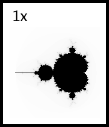

```go
	// See GenerateMathsMandelbrot for implementation details
```


### MathsJulia Pattern


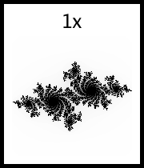

```go
	// See GenerateMathsJulia for implementation details
```


### BooleanOr Pattern


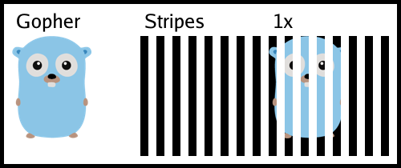

```go
	g := NewGopher()
	v := NewVerticalLine(SetLineSize(10), SetSpaceSize(10), SetLineColor(color.Black), SetSpaceColor(color.White))

	// OR(Gopher, Stripes) -> Max(Gopher, Stripes)
	i := NewOr([]image.Image{g, v})

	f, err := os.Create(BooleanOrOutputFilename)
	if err != nil {
		panic(err)
	}
	defer func() {
		if e := f.Close(); e != nil {
			panic(e)
		}
	}()
	if err = png.Encode(f, i); err != nil {
		panic(err)
	}
```


### MathsSine Pattern


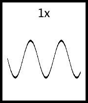

```go
	// See GenerateMathsSine for implementation details
```


### BooleanXor Pattern


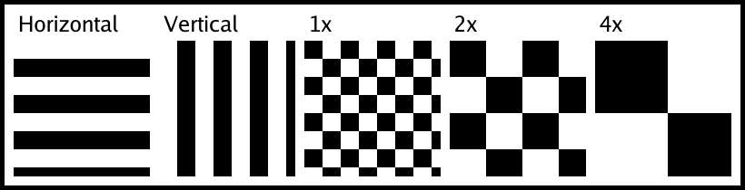

```go
	g := NewGopher()
	v := NewVerticalLine(SetLineSize(20), SetSpaceSize(20), SetLineColor(color.Black))

	// XOR(Gopher, Stripes)
	i := NewXor([]image.Image{g, v}, SetTrueColor(color.RGBA{255, 255, 0, 255}), SetFalseColor(color.Transparent))

	f, err := os.Create(BooleanXorOutputFilename)
	if err != nil {
		panic(err)
	}
	defer func() {
		if e := f.Close(); e != nil {
			panic(e)
		}
	}()
	if err = png.Encode(f, i); err != nil {
		panic(err)
	}
```


### MathsWaves Pattern


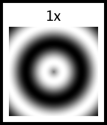

```go
	// See GenerateMathsWaves for implementation details
```


### BooleanNot Pattern


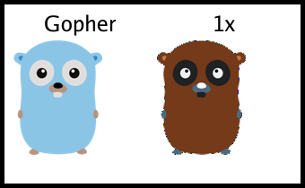

```go
	g := NewGopher()

	// Not Gopher.
	// Default component-wise: Invert colors.
	i := NewNot(g)

	f, err := os.Create(BooleanNotOutputFilename)
	if err != nil {
		panic(err)
	}
	defer func() {
		if e := f.Close(); e != nil {
			panic(e)
		}
	}()
	if err = png.Encode(f, i); err != nil {
		panic(err)
	}
```


### Heatmap Pattern


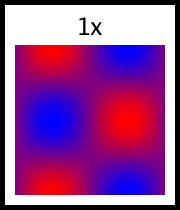

```go
	// See GenerateHeatmap for implementation details
```


### Circle Pattern


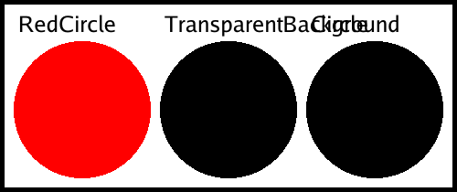

```go
	// Create a simple circle
	c := NewCircle(SetLineColor(color.Black), SetSpaceColor(color.White))
	fmt.Printf("Circle bounds: %v\n", c.Bounds())
	// Output:
	// Circle bounds: (0,0)-(255,255)

	f, err := os.Create(CircleOutputFilename)
	if err != nil {
		panic(err)
	}
	defer func() {
		if e := f.Close(); e != nil {
			panic(e)
		}
	}()
	if err = png.Encode(f, c); err != nil {
		panic(err)
	}
```


### SpeedLines Pattern


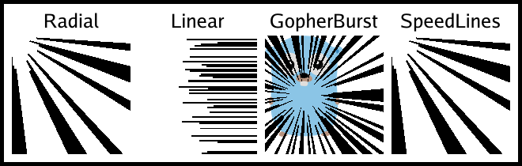

```go
	i := NewSpeedLines(
		SetDensity(150),
		SetMinRadius(30),
		SetMaxRadius(80),
	)
	f, err := os.Create(SpeedLinesOutputFilename)
	if err != nil {
		panic(err)
	}
	defer func() {
		if e := f.Close(); e != nil {
			panic(e)
		}
	}()
	if err = png.Encode(f, i); err != nil {
		panic(err)
	}
```


### Fibonacci Pattern


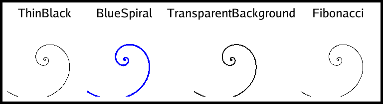

```go
	// Create a simple Fibonacci spiral
	c := NewFibonacci(SetLineColor(color.Black), SetSpaceColor(color.White))
	fmt.Printf("Fibonacci bounds: %v\n", c.Bounds())
	// Output:
	// Fibonacci bounds: (0,0)-(255,255)

	f, err := os.Create(FibonacciOutputFilename)
	if err != nil {
		panic(err)
	}
	defer func() {
		if e := f.Close(); e != nil {
			panic(e)
		}
	}()
	if err = png.Encode(f, c); err != nil {
		panic(err)
	}
```


### ColorMap Pattern


```go
	// 1. Create a Noise source (Perlin Noise with FBM)
	noise := NewNoise(
		NoiseSeed(42), // Fixed seed for reproducible documentation
		SetNoiseAlgorithm(&PerlinNoise{
			Seed:        42,
			Octaves:     4,
			Persistence: 0.5,
			Lacunarity:  2.0,
			Frequency:   0.1,
		}),
	)

	// 2. Map the noise to a "Grass" color ramp
	grass := NewColorMap(noise,
		ColorStop{Position: 0.0, Color: color.RGBA{0, 50, 0, 255}},     // Deep shadow green
		ColorStop{Position: 0.4, Color: color.RGBA{10, 100, 10, 255}},  // Mid green
		ColorStop{Position: 0.7, Color: color.RGBA{50, 150, 30, 255}},  // Light green
		ColorStop{Position: 1.0, Color: color.RGBA{100, 140, 60, 255}}, // Dried tip
	)

	f, err := os.Create(ColorMapOutputFilename)
	if err != nil {
		panic(err)
	}
	defer func() {
		if e := f.Close(); e != nil {
			panic(e)
		}
	}()
	if err = png.Encode(f, grass); err != nil {
		panic(err)
	}
```


### XorGrid Pattern


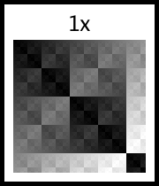

```go
	p := NewXorPattern()
	f, err := os.Create(XorGridOutputFilename)
	if err != nil {
		panic(err)
	}
	defer f.Close()
	if err := png.Encode(f, p); err != nil {
		panic(err)
	}
```


### Quantize Pattern


```go
	i := NewQuantize(NewGopher(), 4)
	f, err := os.Create(QuantizeOutputFilename)
	if err != nil {
		panic(err)
	}
	defer func() {
		if e := f.Close(); e != nil {
			panic(e)
		}
	}()
	if err = png.Encode(f, i); err != nil {
		panic(err)
	}
```


### LinearGradient Pattern


```go
	// Linear Gradient (Horizontal)
	NewLinearGradient(
		SetStartColor(color.RGBA{255, 0, 0, 255}),
		SetEndColor(color.RGBA{0, 0, 255, 255}),
	)
```


### SimpleZoom Pattern


```go
	i := NewSimpleZoom(NewChecker(color.Black, color.White), 2)
	f, err := os.Create(SimpleZoomOutputFilename)
	if err != nil {
		panic(err)
	}
	defer func() {
		if e := f.Close(); e != nil {
			panic(e)
		}
	}()
	if err = png.Encode(f, i); err != nil {
		panic(err)
	}
```


### Transposed Pattern


```go
	i := NewTransposed(NewDemoNull(), 10, 10)
	f, err := os.Create(TransposedOutputFilename)
	if err != nil {
		panic(err)
	}
	defer func() {
		if e := f.Close(); e != nil {
			panic(e)
		}
	}()
	if err = png.Encode(f, i); err != nil {
		panic(err)
	}
```


### RadialGradient Pattern


```go
	// Radial Gradient
	NewRadialGradient(
		SetStartColor(color.RGBA{255, 0, 0, 255}),
		SetEndColor(color.RGBA{0, 0, 255, 255}),
	)
```


### ModuloStripe Pattern


```go
	p := NewModuloStripe([]color.Color{
		color.RGBA{255, 0, 0, 255},
		color.RGBA{0, 255, 0, 255},
		color.RGBA{0, 0, 255, 255},
	})
	f, err := os.Create(ModuloStripeOutputFilename)
	if err != nil {
		panic(err)
	}
	defer f.Close()
	if err := png.Encode(f, p); err != nil {
		panic(err)
	}
```


### Bayer2x2Dither Pattern


```go
	// Black and White Palette
	palette := []color.Color{color.Black, color.White}
	i := NewBayer2x2Dither(NewGopher(), palette)

	f, err := os.Create(Bayer2x2DitherOutputFilename)
	if err != nil {
		panic(err)
	}
	defer func() {
		if e := f.Close(); e != nil {
			panic(e)
		}
	}()
	if err = png.Encode(f, i); err != nil {
		panic(err)
	}
```


### ConcentricRings Pattern


```go
	p := NewConcentricRings([]color.Color{
		color.Black,
		color.White,
		color.RGBA{255, 0, 0, 255},
	})
	f, err := os.Create(ConcentricRingsOutputFilename)
	if err != nil {
		panic(err)
	}
	defer f.Close()
	if err := png.Encode(f, p); err != nil {
		panic(err)
	}
```


### ConicGradient Pattern


```go
	// Conic Gradient
	NewConicGradient(
		SetStartColor(color.RGBA{255, 0, 255, 255}),
		SetEndColor(color.RGBA{0, 255, 255, 255}),
	)
```


### Mirror Pattern


```go
	i := NewMirror(NewDemoMirrorInput(image.Rect(0, 0, 40, 40)), true, false)
	f, err := os.Create(MirrorOutputFilename)
	if err != nil {
		panic(err)
	}
	defer func() {
		if e := f.Close(); e != nil {
			panic(e)
		}
	}()
	if err = png.Encode(f, i); err != nil {
		panic(err)
	}
```


### Rotate Pattern


```go
	i := NewRotate(NewDemoRotateInput(image.Rect(0, 0, 40, 60)), 90)
	f, err := os.Create(RotateOutputFilename)
	if err != nil {
		panic(err)
	}
	defer func() {
		if e := f.Close(); e != nil {
			panic(e)
		}
	}()
	if err = png.Encode(f, i); err != nil {
		panic(err)
	}
```


### Plasma Pattern


```go
	p := NewPlasma()
	f, err := os.Create(PlasmaOutputFilename)
	if err != nil {
		panic(err)
	}
	defer f.Close()
	if err := png.Encode(f, p); err != nil {
		panic(err)
	}
```


### BayerDither Pattern


```go
	grad := NewLinearGradient(
		SetStartColor(color.Black),
		SetEndColor(color.White),
	)
	p := NewBayerDither(grad, 4)
	f, err := os.Create(BayerDitherOutputFilename)
	if err != nil {
		panic(err)
	}
	defer f.Close()
	if err := png.Encode(f, p); err != nil {
		panic(err)
	}
```


### BlueNoise Pattern


```go
	p := NewBlueNoise()
	f, err := os.Create(BlueNoiseOutputFilename)
	if err != nil {
		panic(err)
	}
	defer f.Close()
	if err := png.Encode(f, p); err != nil {
		panic(err)
	}
```


### GradientQuantization Pattern


```go
	grad := NewLinearGradient(
		SetStartColor(color.Black),
		SetEndColor(color.White),
	)
	p := NewQuantize(grad, 4)
	f, err := os.Create(GradientQuantizationOutputFilename)
	if err != nil {
		panic(err)
	}
	defer f.Close()
	if err := png.Encode(f, p); err != nil {
		panic(err)
	}
```


### BitwiseAnd Pattern


```go
	h := NewHorizontalLine(SetLineSize(50), SetSpaceSize(50), SetLineColor(color.RGBA{255, 0, 0, 255}))
	v := NewVerticalLine(SetLineSize(50), SetSpaceSize(50), SetLineColor(color.RGBA{0, 255, 0, 255}))
	p := NewBitwiseAnd([]image.Image{h, v})
	f, err := os.Create(BitwiseAndOutputFilename)
	if err != nil {
		panic(err)
	}
	defer f.Close()
	if err := png.Encode(f, p); err != nil {
		panic(err)
	}
```


### SierpinskiTriangle Pattern


```go
	// See GenerateSierpinskiTriangle for implementation details
```


### VHS Pattern


```go
	// See GenerateVHS for implementation details
```


### SierpinskiCarpet Pattern


```go
	// See GenerateSierpinskiCarpet for implementation details
```


### EdgeDetect Pattern


```go
	i := NewDemoEdgeDetect()
	f, err := os.Create(EdgeDetectOutputFilename)
	if err != nil {
		panic(err)
	}
	defer func() {
		if e := f.Close(); e != nil {
			panic(e)
		}
	}()
	if err = png.Encode(f, i); err != nil {
		panic(err)
	}
```


### ErrorDiffusion Pattern


```go
	// Standard example
	i := NewDemoErrorDiffusion()
	f, err := os.Create(ErrorDiffusionOutputFilename)
	if err != nil {
		panic(err)
	}
	defer func() {
		if e := f.Close(); e != nil {
			panic(e)
		}
	}()
	if err = png.Encode(f, i); err != nil {
		panic(err)
	}
```


### OrderedDither Pattern


```go
	i := NewDemoOrderedDither()
	f, err := os.Create(OrderedDitherOutputFilename)
	if err != nil {
		panic(err)
	}
	defer func() {
		if e := f.Close(); e != nil {
			panic(e)
		}
	}()
	if err = png.Encode(f, i); err != nil {
		panic(err)
	}
```


## License

This project is licensed under the BSD 3-Clause License - see the [LICENSE](LICENSE) file for details.
